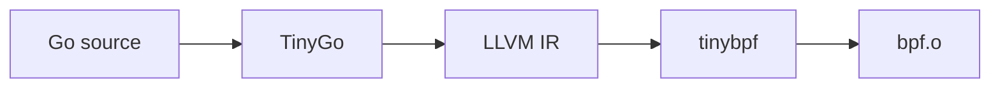

<p align="center">
  <strong>tinybpf</strong><br>
  Write eBPF programs in Go. Compile with TinyGo. Run in the Linux kernel.
</p>

<p align="center">
  <a href="https://github.com/kyleseneker/tinybpf/actions"></a>
  <a href="https://goreportcard.com/report/github.com/kyleseneker/tinybpf"></a>
  <a href="LICENSE"></a>
</p>

---

## Overview

[eBPF](https://ebpf.io/) allows sandboxed programs to run inside the Linux kernel without modifying kernel source or loading kernel modules. Today, eBPF programs must be written in C or [Rust](https://aya-rs.dev/) and compiled to BPF bytecode that passes the kernel verifier.

The Go ecosystem provides mature userspace eBPF tooling ([`cilium/ebpf`](https://github.com/cilium/ebpf) for program loading and [`bpf2go`](https://pkg.go.dev/github.com/cilium/ebpf/cmd/bpf2go) for generating Go bindings) but the kernel-side program itself has always required C.

`tinybpf` removes that requirement. Write the BPF program in Go, compile it with [TinyGo](https://tinygo.org/), and `tinybpf` produces a valid eBPF ELF object that the kernel accepts.



The output is compatible with [`cilium/ebpf`](https://github.com/cilium/ebpf), [`libbpf`](https://github.com/libbpf/libbpf), and [`bpftool`](https://github.com/libbpf/bpftool).

## How it works

`tinybpf` sits between TinyGo's LLVM IR output and the final BPF ELF object. It performs a multi-step IR transformation that retargets the IR from the host architecture to BPF, strips the TinyGo runtime, rewrites helper calls to kernel-compatible form, and injects the metadata that loaders like `cilium/ebpf` and `libbpf` expect.

See [Architecture](docs/ARCHITECTURE.md) for the full pipeline design.

## Quick start

### Installation

```bash
go install github.com/kyleseneker/tinybpf/cmd/tinybpf@latest
```

Or build from source:

```bash
git clone https://github.com/kyleseneker/tinybpf.git
cd tinybpf
make build
```

### Prerequisites

| Dependency | Version | Required |
|------------|---------|----------|
| Go | 1.23+ | Yes |
| TinyGo | 0.40+ | Yes |
| LLVM (`llvm-link`, `opt`, `llc`) | 20+ (must match TinyGo's LLVM) | Yes |
| `llvm-ar`, `llvm-objcopy` | 20+ | For `.a` / `.o` inputs |
| `pahole` | | For BTF injection |

Install everything with one command:

```bash
make setup
```

Run `make doctor` to verify your toolchain.

### Example

A tracepoint probe that captures outbound TCP connections, written entirely in Go:

```go
// tpConnectArgs mirrors the tracepoint context for syscalls/sys_enter_connect.
type tpConnectArgs struct {
    _         [24]byte
    Uservaddr uint64
}

//go:extern bpf_get_current_pid_tgid
func bpfGetCurrentPidTgid() uint64

//go:extern bpf_probe_read_user
func bpfProbeReadUser(dst unsafe.Pointer, size uint32, src unsafe.Pointer) int64

//go:extern bpf_ringbuf_output
func bpfRingbufOutput(mapPtr unsafe.Pointer, data unsafe.Pointer, size uint64, flags uint64) int64

//export handle_connect
func handle_connect(ctx unsafe.Pointer) int32 {
    args := (*tpConnectArgs)(ctx)
    var sa sockaddrIn
    bpfProbeReadUser(unsafe.Pointer(&sa), uint32(unsafe.Sizeof(sa)), unsafe.Pointer(uintptr(args.Uservaddr)))
    if sa.Family != afINET {
        return 0
    }
    pid := uint32(bpfGetCurrentPidTgid() >> 32)
    ev := connectEvent{PID: pid, DstAddrBE: sa.AddrBE, DstPortBE: sa.PortBE, Proto: ipProtoTCP}
    bpfRingbufOutput(unsafe.Pointer(&events), unsafe.Pointer(&ev), uint64(unsafe.Sizeof(ev)), 0)
    return 0
}
```

Compile and link:

```bash
tinygo build -o probe.ll -gc=none -scheduler=none -panic=trap -opt=1 ./bpf

tinybpf --input probe.ll --output probe.o \
  --section handle_connect=tracepoint/syscalls/sys_enter_connect
```

See [`examples/network-sidecar/`](examples/network-sidecar/) for a complete working project with a userspace loader that reads events via `cilium/ebpf`.

## CLI reference

| Flag | Default | Description |
|------|---------|-------------|
| `--input` | *(required)* | Input file (`.ll`, `.bc`, `.o`, `.a`). Repeatable. |
| `--output`, `-o` | `bpf.o` | Output ELF path. |
| `--probe` | *(auto-detect)* | Probe function to keep. Repeatable. |
| `--section` | | Probe-to-section mapping (`name=section`). Repeatable. |
| `--cpu` | `v3` | BPF CPU version for `llc -mcpu`. |
| `--opt-profile` | `default` | `conservative`, `default`, `aggressive`, or `verifier-safe`. |
| `--pass-pipeline` | | Explicit `opt` pass pipeline (overrides profile). |
| `--config` | | Path to `linker-config.json` for custom passes. |
| `--jobs`, `-j` | `1` | Parallel input normalization workers. |
| `--btf` | `false` | Inject BTF via `pahole`. |
| `--pahole` | | Path to `pahole`. |
| `--verbose`, `-v` | `false` | Print each pipeline stage. |
| `--timeout` | `30s` | Per-stage timeout. |
| `--keep-temp` | `false` | Preserve intermediate files for debugging. |
| `--tmpdir` | | Directory for intermediate files. |
| `--llvm-link` | | Override path to `llvm-link`. |
| `--opt` | | Override path to `opt`. |
| `--llc` | | Override path to `llc`. |
| `--llvm-ar` | | Override path to `llvm-ar`. |
| `--llvm-objcopy` | | Override path to `llvm-objcopy`. |

## Documentation

| Document | Description |
|----------|-------------|
| [Writing Go for eBPF](docs/TINYGO_COMPAT.md) | Language constraints, probe structure, and supported BPF helpers |
| [Architecture](docs/ARCHITECTURE.md) | Pipeline design and the 11-step IR transformation |
| [Support Matrix](docs/SUPPORT_MATRIX.md) | Tested toolchain versions and platforms |
| [Roadmap](docs/ROADMAP.md) | Release milestones and planned work |
| [Contributing](CONTRIBUTING.md) | Development setup, guidelines, and PR process |

## Related projects

| Project | Relationship |
|---------|-------------|
| [cilium/ebpf](https://github.com/cilium/ebpf) | Go library for loading eBPF programs; loads `tinybpf` output |
| [bpf2go](https://pkg.go.dev/github.com/cilium/ebpf/cmd/bpf2go) | Compiles C eBPF and generates Go bindings; replaced when the probe is Go |
| [libbpf](https://github.com/libbpf/libbpf) | C loader library; compatible with `tinybpf` output |
| [TinyGo](https://tinygo.org/) | Go compiler targeting LLVM; provides the IR that `tinybpf` transforms |
| [Aya](https://aya-rs.dev/) | eBPF in Rust; similar goal, different language |
| [miekg/bpf](https://github.com/miekg/bpf) | Prior effort to add BPF to TinyGo's LLVM; archived |

## License

[MIT](LICENSE)
