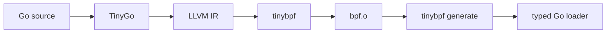

<p align="center">
  
</p>

<h1 align="center">tinybpf</h1>

<p align="center">
  Write eBPF programs in Go. Compile with TinyGo. Run in the Linux kernel.
</p>

<p align="center">
  <a href="https://github.com/kyleseneker/tinybpf/actions"></a>
  <a href="https://goreportcard.com/report/github.com/kyleseneker/tinybpf"></a>
  <a href="LICENSE"></a>
</p>

---

## Why tinybpf?

[eBPF](https://ebpf.io/) lets sandboxed programs run inside the Linux kernel -- but today those programs must be written in C or Rust, even when the rest of your stack is Go.

`tinybpf` lets you write both the kernel-side BPF program and the userspace loader in Go. No C, no CGo, no `bpf2go` code generation from C sources. One language, one toolchain.


```mermaid
graph LR
    A["Go source"] --> B["TinyGo"]
    B --> C["LLVM IR"]
    C --> D["tinybpf"]
    D --> E["bpf.o"]
    E --> F["tinybpf generate"]
    F --> G["typed Go loader"]
```

The output is a standard BPF ELF object compatible with [`cilium/ebpf`](https://github.com/cilium/ebpf), [`libbpf`](https://github.com/libbpf/libbpf), and [`bpftool`](https://github.com/libbpf/bpftool). `tinybpf generate` then reads that object and produces type-safe Go structs for loading it -- no string-based map lookups, no `unsafe.Pointer` casts.

## Quick start

```bash
# Scaffold, build, and generate a typed loader
tinybpf init my_probe && cd my_probe
make build
make generate
```

Write your BPF program in Go:

```go
//go:build tinygo
package main

import "unsafe"

//go:extern bpf_get_current_pid_tgid
func bpfGetCurrentPidTgid() uint64

//export my_probe
func my_probe(ctx unsafe.Pointer) int32 {
    _ = bpfGetCurrentPidTgid()
    return 0
}

func main() {}
```

Load and attach with the generated typed structs:

```go
// Generated by tinybpf generate -- type-safe, no string lookups
objs, err := loader.Load("build/my_probe.bpf.o")
defer objs.Close()

// objs.MyProbe is a *ebpf.Program -- use it directly with cilium/ebpf
kp, err := link.Kprobe("do_sys_openat2", objs.MyProbe, nil)
```

### Prerequisites

| Dependency | Version | Required |
|------------|---------|----------|
| Go | 1.24+ | Yes |
| TinyGo | 0.40+ | Yes |
| LLVM (`llvm-link`, `opt`, `llc`) | 20+ | Yes |
| `llvm-ar`, `llvm-objcopy` | 20+ | For `.a` / `.o` inputs |
| `pahole` | | For BTF injection |

Or install everything at once:

```bash
make setup    # install all dependencies
make doctor   # verify toolchain
```

See [Getting Started](docs/getting-started.md) for toolchain install details.

## Examples

### Tracing and observability

| Example | Hook type | What it demonstrates |
|---------|-----------|---------------------|
| [tracepoint-connect](examples/tracepoint-connect/) | Tracepoint | Ring buffer, event capture, `cilium/ebpf` loader |
| [kprobe-openat](examples/kprobe-openat/) | Kprobe | Function tracing, `pt_regs` context |
| [fentry-open](examples/fentry-open/) | Fentry | BTF-based tracing (kernel 5.5+) |
| [rawtp-sched](examples/rawtp-sched/) | Raw tracepoint | CO-RE portable structs, perf event array |
| [percpu-counter](examples/percpu-counter/) | Tracepoint | Per-CPU array map, lock-free counting |

### Networking and policy

| Example | Hook type | What it demonstrates |
|---------|-----------|---------------------|
| [cgroup-connect](examples/cgroup-connect/) | Cgroup | Hash map blocklist, connection policy |
| [xdp-filter](examples/xdp-filter/) | XDP | Packet parsing, source IP blocklist |
| [tc-filter](examples/tc-filter/) | TC classifier | Port-based packet filtering |

### Security

| Example | Hook type | What it demonstrates |
|---------|-----------|---------------------|
| [lsm-file-open](examples/lsm-file-open/) | LSM | Security audit hook, file open monitoring |

### Kfuncs

| Example | Hook type | What it demonstrates |
|---------|-----------|---------------------|
| [kfunc-task](examples/kfunc-task/) | Fentry | `bpf_task_from_pid` + `bpf_task_release`, BTF-resolved kernel functions |

Build and run any example:

```bash
make example NAME=tracepoint-connect
sudo ./examples/tracepoint-connect/scripts/run.sh
```

Each example has its own README with attach/run details.

## Library usage

Use `tinybpf` as a Go library to compile BPF objects programmatically:

```go
result, err := tinybpf.Build(context.Background(), tinybpf.Request{
    Package: "./bpf",
    Output:  "probe.bpf.o",
})
```

See the [`Request`](https://pkg.go.dev/github.com/kyleseneker/tinybpf#Request) documentation for all options.

## How it compares

| | tinybpf | bpf2go (cilium/ebpf) | Aya (Rust) |
|---|---|---|---|
| BPF program language | **Go** | C | Rust |
| Loader language | Go | Go | Rust |
| CGo dependency | No | No | No |
| Type-safe loader codegen | Yes | Yes | Yes |
| Loader library | cilium/ebpf | cilium/ebpf | aya |

`tinybpf` is for teams that want to write eBPF in Go instead of maintaining a C/Go split. If your stack is already Go, you no longer need C for the kernel side.

## Documentation

| Document | Description |
|----------|-------------|
| [Getting Started](docs/getting-started.md) | Toolchain prerequisites and install |
| [Writing Go for eBPF](docs/writing-go-for-ebpf.md) | Language constraints, helpers, CO-RE, kfuncs |
| [CLI Reference](docs/cli-reference.md) | Every command, flag, and default |
| [Config Reference](docs/config-reference.md) | `tinybpf.json` schema and merge rules |
| [Troubleshooting](docs/troubleshooting.md) | Setup issues, pipeline errors, verifier debugging |
| [Architecture](docs/architecture.md) | Pipeline design and the 8-pass IR transformation |
| [Project Layout](docs/project-layout.md) | Package map |
| [Support Matrix](docs/support-matrix.md) | Tested toolchain versions and platforms |

## License

[MIT](LICENSE)
