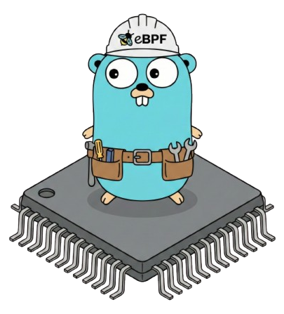
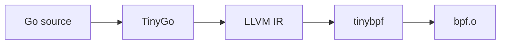

<p align="center">
  
</p>

<h1 align="center">tinybpf</h1>

<p align="center">
  Write eBPF programs in Go. Compile with TinyGo. Run in the Linux kernel.
</p>

<p align="center">
  <a href="https://github.com/kyleseneker/tinybpf/actions"></a>
  <a href="https://goreportcard.com/report/github.com/kyleseneker/tinybpf"></a>
  <a href="LICENSE"></a>
</p>

---

## What is tinybpf?

[eBPF](https://ebpf.io/) lets sandboxed programs run inside the Linux kernel. Today those programs must be written in C or Rust. `tinybpf` lets you write them in Go instead.


```mermaid
graph LR
    A["Go source"] --> B["TinyGo"]
    B --> C["LLVM IR"]
    C --> D["tinybpf"]
    D --> E["bpf.o"]
```

The output is a standard BPF ELF object compatible with [`cilium/ebpf`](https://github.com/cilium/ebpf), [`libbpf`](https://github.com/libbpf/libbpf), and [`bpftool`](https://github.com/libbpf/bpftool). See [Writing Go for eBPF](docs/writing-go-for-ebpf.md) for how the language subset and compilation model work.

## Quick start

### Prerequisites

| Dependency | Version | Required |
|------------|---------|----------|
| Go | 1.24+ | Yes |
| TinyGo | 0.40+ | Yes |
| LLVM (`llvm-link`, `opt`, `llc`) | 20+ | Yes |
| `llvm-ar`, `llvm-objcopy` | 20+ | For `.a` / `.o` inputs |
| `pahole` | | For BTF injection |

### Install

```bash
go install github.com/kyleseneker/tinybpf/cmd/tinybpf@latest
```

Or use the setup script (installs all dependencies):

```bash
make setup    # install everything
make doctor   # verify toolchain
```

### Build your first BPF object

Scaffold a project:

```bash
tinybpf init my_probe
cd my_probe
```

This generates a `tinybpf.json`, a BPF source file in `bpf/`, a stub file for IDE compatibility, and a Makefile. Build it:

```bash
make
```

The output is a BPF ELF object at `build/my_probe.bpf.o`, ready for any BPF loader.

See [Getting Started](docs/getting-started.md) for a complete walkthrough.

## Examples

| Example | Hook type | What it demonstrates |
|---------|-----------|---------------------|
| [tracepoint-connect](examples/tracepoint-connect/) | Tracepoint | Ring buffer, `cilium/ebpf` loader, live event capture |
| [kprobe-openat](examples/kprobe-openat/) | Kprobe | Function tracing, `pt_regs` context, architecture offsets |
| [fentry-open](examples/fentry-open/) | Fentry | BTF-based tracing (kernel 5.5+) |
| [rawtp-sched](examples/rawtp-sched/) | Raw tracepoint | CO-RE portable structs, perf event array |
| [cgroup-connect](examples/cgroup-connect/) | Cgroup | Hash map blocklist, connection policy |
| [xdp-filter](examples/xdp-filter/) | XDP | Packet parsing, source IP blocklist |
| [tc-filter](examples/tc-filter/) | TC classifier | Port-based packet filtering |

See [Examples Guide](docs/examples.md) for learning tracks and how to run them.

## Documentation

| Document | Description |
|----------|-------------|
| [Getting Started](docs/getting-started.md) | Install, scaffold, build, and load your first BPF program |
| [Writing Go for eBPF](docs/writing-go-for-ebpf.md) | Language constraints, helpers, CO-RE, and patterns |
| [CLI Reference](docs/cli-reference.md) | Every command, flag, and default |
| [Config Reference](docs/config-reference.md) | `tinybpf.json` schema, auto-discovery, and merge rules |
| [Examples Guide](docs/examples.md) | Learning tracks and how to run examples |
| [Troubleshooting](docs/troubleshooting.md) | Setup issues, pipeline errors, and verifier debugging |
| [Architecture](docs/architecture.md) | Pipeline design and the 8-pass IR transformation |
| [Support Matrix](docs/support-matrix.md) | Tested toolchain versions, kernels, and platforms |
| [Project Layout](docs/project-layout.md) | Package map for contributors |
| [Contributing](CONTRIBUTING.md) | Development setup, testing, and PR process |

## Related projects

| Project | Relationship |
|---------|-------------|
| [cilium/ebpf](https://github.com/cilium/ebpf) | Go library for loading eBPF programs; loads `tinybpf` output |
| [bpf2go](https://pkg.go.dev/github.com/cilium/ebpf/cmd/bpf2go) | Compiles C eBPF and generates Go bindings; replaced when the program is Go |
| [libbpf](https://github.com/libbpf/libbpf) | C loader library; compatible with `tinybpf` output |
| [TinyGo](https://tinygo.org/) | Go compiler targeting LLVM; provides the IR that `tinybpf` transforms |
| [Aya](https://aya-rs.dev/) | eBPF in Rust; similar goal, different language |
| [miekg/bpf](https://github.com/miekg/bpf) | Prior effort to add BPF to TinyGo's LLVM; archived |

## License

[MIT](LICENSE)
