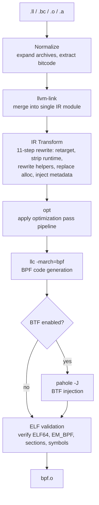

# Architecture

## Pipeline overview

`tinybpf` executes a fixed sequence of stages to transform TinyGo-emitted LLVM IR into a valid eBPF ELF object. Each stage either invokes a standard LLVM binary or performs in-process IR rewriting. Every stage fails fast with a structured diagnostic on error.



## Package layout

```
cmd/tinybpf/        CLI entrypoint
internal/
  cli/                     Flag parsing and subcommand dispatch
  pipeline/                Orchestration, input normalization, BTF injection
  transform/               TinyGo IR -> BPF IR rewriting (11 transform steps)
  llvm/                    Tool discovery, optimization profiles, process execution, config loading
  elfcheck/                Post-link ELF validation
  diag/                    Structured error types with stage context and hints
  doctor/                  Toolchain diagnostic subcommand
testdata/                  TinyGo IR fixtures for transform tests
examples/
  network-sidecar/         End-to-end example: Go eBPF probe + userspace loader
```

## Design decisions

### Shell out to LLVM binaries

The linker drives standalone LLVM tools (`llvm-link`, `opt`, `llc`) rather than linking against `libLLVM`. This avoids a CGo dependency on a specific LLVM version. Users install whichever LLVM matches their TinyGo, and the Go binary stays small, portable, and easy to cross-compile.

### Text-based IR transformation

The `internal/transform` package operates on LLVM IR text (`.ll` files) using line-level string parsing and rewriting. Hot paths use hand-written scanners instead of compiled regular expressions, keeping the transform pipeline allocation-light and fast. This avoids a CGo/libLLVM dependency, works across LLVM versions that produce text IR, and is straightforward to test and debug.

The tradeoff is reliance on textual patterns rather than a semantic AST. In practice, TinyGo's IR output is consistent and well-characterized, making this approach reliable.

### Fail-fast structured diagnostics

Every pipeline stage produces a `diag.Error` carrying the stage name, the command that failed, and a human-readable hint. LLVM tool errors can be cryptic; wrapping them with context makes debugging practical for users.

### Named optimization profiles

The `--opt-profile` flag maps to curated LLVM pass sequences tuned for BPF verifier compliance:

| Profile | Description |
|---------|-------------|
| `conservative` | Minimal optimization; preserves IR structure |
| `default` | Size-optimized (`Os`), fits BPF instruction count budgets |
| `aggressive` | Maximum optimization |
| `verifier-safe` | Hand-tuned pipeline excluding loop unrolling and vectorization |

Users who need full control can provide `--pass-pipeline` directly. LLVM also auto-injects BPF-specific passes when the target triple is `bpf`.

### Binary allowlist and environment sanitization

Every external binary execution passes through `llvm.Run`, which injects a minimal subprocess environment (`LC_ALL=C`, `TZ=UTC`, and only `PATH`/`HOME`/`TMPDIR` from the host). This prevents locale or timezone leaks from affecting LLVM output, supporting deterministic builds.

At tool discovery time, every resolved path is validated against an allowlist of known tool basenames (`llvm-link`, `opt`, `llc`, `llvm-ar`, `llvm-objcopy`, `pahole`, `tinygo`, `ld.lld`). Version-suffixed names like `opt-18` are accepted. Paths containing shell metacharacters are rejected. This prevents path hijacking and ensures `exec.Command` is never invoked with an unexpected binary.

Intermediate build artifacts are written to a directory created with `0700` permissions and cleaned up on exit unless `--keep-temp` is passed.

### Custom opt passes via config

The `--config` flag accepts a `linker-config.json` file containing an array of custom LLVM pass names:

```json
{
  "custom_passes": ["-inline", "-instcombine"]
}
```

Every pass name is validated against a strict pattern before being appended to the `opt` pipeline. This allows users to extend optimization without opening a command-injection vector.

### Input normalization as an explicit stage

Archives (`.a`) and object files with embedded bitcode (`.o`) require extraction before linking. A dedicated normalization stage keeps the link step clean and makes supported input formats extensible. When multiple inputs are provided, `--jobs` enables parallel normalization bounded by a semaphore.

### Inspectable intermediates

The `--keep-temp` and `--tmpdir` flags preserve every intermediate file. When diagnosing verifier failures, being able to inspect the optimized IR and pre-link object is essential.

## IR transformation pipeline

The transformation runs 11 steps in sequence. Each step takes a slice of IR text lines and returns a modified slice.


| Step | Operation | Purpose |
|------|-----------|---------|
| 1 | **Retarget** | Replace `target datalayout` and `target triple` with BPF values |
| 2 | **Strip attributes** | Remove host-specific function attributes (`target-cpu`, `target-features`, `allockind`, etc.) |
| 3 | **Extract programs** | Keep only user program functions and their dependencies; discard TinyGo runtime (debug metadata preserved for BTF) |
| 4 | **Replace alloc** | Convert `@runtime.alloc` calls to entry-block `alloca` + `llvm.memset` |
| 5 | **Rewrite helpers** | Convert mangled `@main.bpfXxx(args, ptr undef)` calls to `inttoptr (i64 ID to ptr)(args)` |
| 6 | **Assign sections** | Apply ELF section attributes to program functions and map globals; promote `internal` map globals to global linkage |
| 7 | **Strip map prefix** | Rename Go package-qualified map globals (`@main.events` → `@events`) to match the C BPF naming convention |
| 8 | **Rewrite map BTF** | Transform `bpfMapDef` globals and DWARF metadata to libbpf-compatible BTF encoding |
| 9 | **Sanitize BTF names** | Replace `.` with `_` in Go-style type names; strip names from `DW_TAG_pointer_type` nodes |
| 10 | **Add license** | Inject `license` section with `"GPL"` if not present |
| 11 | **Cleanup** | Remove orphaned declares, unreferenced globals, stale attribute groups, and leftover comments |
