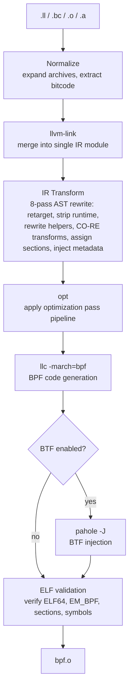
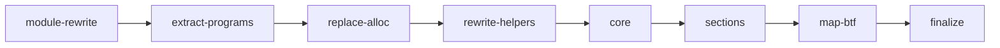

# Architecture

## Pipeline overview

`tinybpf` transforms TinyGo-emitted LLVM IR into a valid eBPF ELF object through a fixed sequence of stages. Each stage either invokes a standard LLVM binary or performs in-process IR rewriting, failing fast with a structured diagnostic on error.


```mermaid
graph TD
    A[".ll / .bc / .o / .a"] --> B["Normalize<br>expand archives, extract bitcode"]
    B --> C["llvm-link<br>merge into single IR module"]
    C --> D["IR Transform<br>8-pass AST rewrite: retarget, strip runtime,<br>rewrite helpers, CO-RE transforms, assign sections, inject metadata"]
    D --> E["opt<br>apply optimization pass pipeline"]
    E --> F["llc -march=bpf<br>BPF code generation"]
    F --> G{"BTF enabled?"}
    G -- yes --> H["pahole -J<br>BTF injection"]
    G -- no --> I["ELF validation<br>verify ELF64, EM_BPF, sections, symbols"]
    H --> I
    I --> J["bpf.o"]
```

## Package layout

```
cmd/tinybpf/               CLI entrypoint
config/                    Project config loading (tinybpf.json), validation, and merge
diag/                      Structured error types with stage context and hints
doctor/                    Toolchain diagnostic subcommand
elfcheck/                  Post-link ELF validation
internal/
  cli/                     Flag parsing and subcommand dispatch
  testutil/                Test helpers (fake LLVM tools, sample IR)
ir/                        LLVM IR parser, AST, serializer, and index
  testdata/                IR fixture files for parser/serializer tests
llvm/                      Tool discovery, optimization profiles, process execution
pipeline/                  Orchestration, input normalization, BTF injection
scaffold/                  Project scaffolding (tinybpf init)
transform/                 TinyGo IR -> BPF IR rewriting
```

## Design decisions

### Shell out to LLVM binaries

The linker drives standalone LLVM tools (`llvm-link`, `opt`, `llc`) rather than linking against `libLLVM`. This avoids a CGo dependency on a specific LLVM version. Users install whichever LLVM matches their TinyGo, and the Go binary stays small, portable, and easy to cross-compile.

### AST-based IR transformation

The `ir` package provides a lightweight parser that builds a structured AST from LLVM IR text, covering the subset of IR that TinyGo emits: type definitions, globals, declares, functions (with basic blocks and instructions), attribute groups, and metadata nodes. The `transform` package then operates on this AST, modifying nodes directly rather than manipulating raw text lines. After all transforms complete, the AST is serialized back to IR text for the LLVM optimization and codegen stages.

Unrecognized IR constructs are preserved verbatim through `Raw` fields on every AST node, guaranteeing faithful round-trip serialization (`Serialize(Parse(input)) == input` for unmodified modules). This avoids a CGo/libLLVM dependency, works across LLVM versions, and gives transforms structured access to functions, instructions, globals, and metadata without relying on fragile textual patterns.

### Fail-loud on partial match

Every transform that uses a two-stage filter (marker string check followed by regex or parser) **must** error when the marker is present but the second stage fails. A line containing `@main.bpf` inside a `call` that doesn't match the helper regex, a `bpfMapDef` global with an unparseable initializer, or a `bpfCore` GEP that doesn't match the expected pattern — these are all cases where silently skipping the line would produce an output that compiles but behaves incorrectly at load time.

The rule: if we recognize *what* a line is trying to do but can't parse *how*, that is an error, not a skip. Transforms that operate on simple string replacement (retarget, attribute stripping, license injection) don't need this treatment because there's no partial-match scenario — the operation either applies or the line is unrelated.

### Structured diagnostics

Every pipeline stage produces a `diag.Error` carrying the stage name, the command that failed, and a human-readable hint. LLVM tool errors can be cryptic; wrapping them with context makes debugging practical for users.

Transform passes that iterate independent items (helper rewrites, CO-RE access/exists, alloc replacement, map BTF) collect all errors in a single pass and return them as a `diag.Errors`, so that the user sees every problem at once instead of fixing one error per rebuild. Structural stages (module rewrite, sections, finalize) remain fail-fast because their errors cascade.

Unknown BPF helper names include fuzzy-match suggestions ("did you mean?") based on Levenshtein distance against the generated helper table.

### Named optimization profiles

The `--opt-profile` flag maps to curated LLVM pass sequences tuned for BPF verifier compliance:

| Profile | Description |
|---------|-------------|
| `conservative` | Minimal optimization; preserves IR structure |
| `default` | Size-optimized (`Os`), fits BPF instruction count budgets |
| `aggressive` | Maximum optimization |
| `verifier-safe` | Hand-tuned pipeline excluding loop unrolling and vectorization |

Users who need full control can provide `--pass-pipeline` directly. LLVM also auto-injects BPF-specific passes when the target triple is `bpf`.

### Binary allowlist and environment sanitization

Every external binary execution passes through `llvm.Run`, which injects a minimal subprocess environment (`LC_ALL=C`, `TZ=UTC`, and only `PATH`/`HOME`/`TMPDIR` from the host). This prevents locale or timezone leaks from affecting LLVM output, supporting deterministic builds.

At tool discovery time, every resolved path is validated against an allowlist of known tool basenames (`llvm-link`, `opt`, `llc`, `llvm-ar`, `llvm-objcopy`, `pahole`, `tinygo`, `ld.lld`). Version-suffixed names like `opt-18` are accepted. Paths containing shell metacharacters are rejected. This prevents path hijacking and ensures `exec.Command` is never invoked with an unexpected binary.

Intermediate build artifacts are written to a directory created with `0700` permissions and cleaned up on exit unless `--keep-temp` is passed.

### Project configuration

The `tinybpf.json` file stores project-level build settings (output path, CPU version, optimization profile, program-to-section mappings, custom passes, and toolchain paths). The CLI auto-discovers this file by walking parent directories from the current working directory, like `go.mod`. CLI flags override config file values for one-off invocations.

Custom LLVM opt passes are specified in `build.custom_passes`:

```json
{
  "build": {
    "custom_passes": ["inline", "instcombine"]
  }
}
```

Every pass name is validated against a strict pattern before being appended to the `opt` pipeline. This allows users to extend optimization without opening a command-injection vector.

### Input normalization as an explicit stage

Archives (`.a`) and object files with embedded bitcode (`.o`) require extraction before linking. A dedicated normalization stage keeps the link step clean and makes supported input formats extensible. When multiple inputs are provided, `--jobs` enables parallel normalization bounded by a semaphore.

### Inspectable intermediates

The `--keep-temp` and `--tmpdir` flags preserve every intermediate file. When diagnosing verifier failures, being able to inspect the optimized IR and pre-link object is essential.

### IR stage dump

The `--dump-ir` flag writes a snapshot of the IR after each transform pass into a `dump-ir/` subdirectory of the temp workspace. Files are numbered sequentially (`01-module-rewrite.ll`, `02-extract-programs.ll`, etc.), making it easy to diff consecutive passes and isolate which transform introduced a problem.

### Enriched error context

Transform-stage errors include the IR line number and a source snippet surrounding the failing line. For example, an unknown BPF helper error will show the exact IR call instruction and its neighbors, rather than just a function name.

## IR transformation pipeline

TinyGo emits valid LLVM IR, but it targets the host architecture and carries Go runtime artifacts that the BPF verifier would reject. The 8-pass transformation bridges this gap, including automatic CO-RE (Compile Once – Run Everywhere) support for `bpfCore`-prefixed struct types. Each pass operates on the parsed AST and may combine several logically related rewrites into a single traversal:

- **Pass 1** (module-rewrite) makes the IR architecture-neutral so `llc -march=bpf` can codegen it. Retargets the data layout and triple, and strips host-specific CPU feature attributes.
- **Passes 2–3** (extract-programs, replace-alloc) strip the TinyGo runtime and eliminate heap allocation. The BPF VM has no heap and no scheduler — any runtime code left in the module would fail verification.
- **Pass 4** (rewrite-helpers) translates Go-style BPF helper declarations into the integer-ID calling convention the kernel expects (211 helpers supported (complete kernel coverage)). Without this, the verifier sees unknown function calls and rejects the program.
- **Pass 5** (core) handles all CO-RE transforms in one pass: replaces getelementptr instructions on bpfCore-prefixed structs with `llvm.preserve.struct.access.index` intrinsics, rewrites `bpfCoreFieldExists`/`bpfCoreTypeExists` calls to preserve intrinsics, and converts Go CamelCase field names to kernel-compatible snake_case. No-op when the program has no `bpfCore*` types.
- **Pass 6** (sections) assigns ELF sections to programs and data: places user-defined globals into `.data`, `.rodata`, or `.bss` and applies BPF program section attributes to functions.
- **Pass 7** (map-btf) handles all map-related transforms: strips Go package prefixes from map globals, transforms `bpfMapDef` globals and DWARF metadata to libbpf-compatible BTF encoding, and sanitizes Go-style type names to C conventions.
- **Pass 8** (finalize) adds the GPL license section and removes dead IR (orphaned declares, unreferenced globals, stale attribute groups).

Each pass receives a parsed `*ir.Module` and modifies the AST in place.


```mermaid
graph LR
    A["module-rewrite"] --> B["extract-programs"]
    B --> C["replace-alloc"]
    C --> D["rewrite-helpers"]
    D --> E["core"]
    E --> F["sections"]
    F --> G["map-btf"]
    G --> H["finalize"]
```

| Pass | Name | Consolidates | Purpose |
|------|------|--------------|---------|
| 1 | **module-rewrite** | retarget, strip-attributes | Replace `target datalayout` and `target triple` with BPF values; remove host-specific function attributes (`target-cpu`, `target-features`, `allockind`, etc.) |
| 2 | **extract-programs** | — | Keep only user program functions and their dependencies; discard TinyGo runtime (debug metadata preserved for BTF) |
| 3 | **replace-alloc** | — | Convert `@runtime.alloc` calls to entry-block `alloca` + `llvm.memset` |
| 4 | **rewrite-helpers** | — | Convert mangled `@main.bpfXxx(args, ptr undef)` calls to `inttoptr (i64 ID to ptr)(args)` |
| 5 | **core** | rewrite-core-access, rewrite-core-exists, sanitize-core-fields | Replace getelementptr on bpfCore structs with preserve intrinsics; rewrite field/type existence calls; convert CamelCase metadata field names to snake_case (no-op without `bpfCore*` types) |
| 6 | **sections** | assign-data-sections, assign-program-sections | Place user-defined globals into `.data`/`.rodata`/`.bss`; apply BPF section attributes to functions and `.maps` to map globals; promote `internal` linkage to global |
| 7 | **map-btf** | strip-map-prefix, rewrite-map-btf, sanitize-btf-names | Rename package-qualified map globals (`@main.events` → `@events`); transform `bpfMapDef` globals to libbpf-compatible BTF encoding; replace `.` with `_` in type names |
| 8 | **finalize** | add-license, cleanup | Inject `license` section with `"GPL"` if not present; remove orphaned declares, unreferenced globals, and stale attribute groups |
