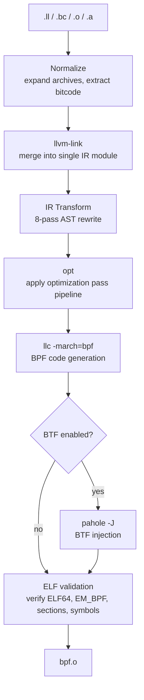
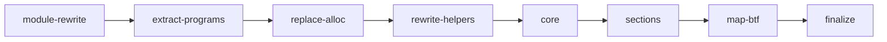

# Architecture

## Pipeline overview

`tinybpf` transforms TinyGo-emitted LLVM IR into a valid eBPF ELF object through a fixed sequence of stages. Each stage either invokes a standard LLVM binary or performs in-process IR rewriting, failing fast with a structured diagnostic on error.

### Stage details

| Stage | Input | Output | Cached | Error stage |
|-------|-------|--------|--------|-------------|
| Normalize | `.ll`, `.bc`, `.o`, `.a` | IR/bitcode paths | No | `input-normalization` |
| Link | Normalized IR | `01-linked.ll` | Yes | `llvm-link` |
| Transform | `01-linked.ll` | `02-transformed.ll` | Yes | `transform` |
| Opt | `02-transformed.ll` | `03-optimized.ll` | Yes | `opt` |
| Codegen | `03-optimized.ll` | `04-codegen.o` | Yes | `llc` |
| Finalize | `04-codegen.o` | output path | No | `finalize` |
| BTF | output ELF | output ELF (in-place) | No | `btf` |
| ELF validate | output ELF | *(validation only)* | No | `elf-validate` |

### Cache keys

Each cached stage computes a SHA-256 key from its inputs and tool configuration:

| Stage | Key components |
|-------|---------------|
| Link | `"link"` + file content hashes + `llvm-link` path |
| Transform | `"transform"` + linked IR hash + programs + sorted sections |
| Opt | `"opt"` + transformed IR hash + `opt` path + pass pipeline + profile + custom passes |
| Codegen | `"codegen"` + optimized IR hash + `llc` path + CPU flag |

Cache is stored under `$XDG_CACHE_HOME/tinybpf/v1/` in two-character hex shard directories. Tool paths are included (not versions) because the same path with an upgraded binary produces different output.

## IR transformation pipeline

TinyGo emits valid LLVM IR, but it targets the host architecture and carries Go runtime artifacts that the BPF verifier would reject. The 8-pass transformation bridges this gap, including automatic CO-RE (Compile Once -- Run Everywhere) support for `bpfCore`-prefixed struct types.

| Pass | Name | Consolidates | Purpose | Error behavior |
|------|------|--------------|---------|----------------|
| 1 | **module-rewrite** | retarget, strip-attributes | Replace `target datalayout` and `target triple` with BPF values; remove host-specific function attributes (`target-cpu`, `target-features`, `allockind`, etc.) | Fail-fast |
| 2 | **extract-programs** | -- | Keep only user program functions and their dependencies; discard TinyGo runtime (debug metadata preserved for BTF) | Fail-fast |
| 3 | **replace-alloc** | -- | Convert `@runtime.alloc` calls to entry-block `alloca` + `llvm.memset` | Collect-all |
| 4 | **rewrite-helpers** | -- | Convert mangled `@main.bpfXxx(args, ptr undef)` calls to `inttoptr (i64 ID to ptr)(args)` | Collect-all |
| 5 | **core** | rewrite-core-access, rewrite-core-exists, sanitize-core-fields | Replace getelementptr on `bpfCore` structs with preserve intrinsics; rewrite field/type existence calls; convert CamelCase metadata field names to snake_case (no-op without `bpfCore*` types) | Collect-all |
| 6 | **sections** | assign-data-sections, assign-program-sections | Place user-defined globals into `.data`/`.rodata`/`.bss`; apply BPF section attributes to functions and `.maps` to map globals; promote `internal` linkage to global | Fail-fast |
| 7 | **map-btf** | strip-map-prefix, rewrite-map-btf, sanitize-btf-names | Rename package-qualified map globals (`@main.events` -> `@events`); transform `bpfMapDef` globals to libbpf-compatible BTF encoding; replace `.` with `_` in type names | Collect-all |
| 8 | **finalize** | add-license, cleanup | Inject `license` section with `"GPL"` if not present; remove orphaned declares, unreferenced globals, and stale attribute groups | Fail-fast |

**Error behavior**: Passes marked "collect-all" accumulate all errors in a single traversal and return them together, so the user sees every problem at once. Passes marked "fail-fast" stop on the first error because their failures cascade.

Each pass receives a parsed `*ir.Module` and modifies the AST in place.

## Design notes

- **Shell out to LLVM.** The pipeline invokes `llvm-link`, `opt`, `llc` as
  subprocesses rather than linking against `libLLVM`. No CGo; the Go binary
  stays portable.
- **AST-based IR rewriting.** `internal/ir` parses LLVM IR into an AST with
  `Raw` fallback fields on every node, guaranteeing round-trip serialization
  (`Serialize(Parse(input)) == input` for unmodified modules). Transforms
  operate on structure, not text.
- **Fail loud on partial match.** If a transform recognizes *what* a
  construct is but can't parse *how*, it errors rather than silently skipping.
- **Collect-all vs fail-fast.** Item-level passes (helper rewrites, CO-RE,
  alloc, map BTF) accumulate every error per run; structural passes
  (module rewrite, sections, finalize) stop on first failure.
- **Unknown helpers suggest alternatives.** Levenshtein-based "did you mean?"
  hints on the generated helper table.
- **Subprocess sanitization.** Every tool invocation passes through
  `llvm.Run`, which sets `LC_ALL=C`, `TZ=UTC`, and forwards only
  `PATH`/`HOME`/`TMPDIR`. Resolved paths are checked against a basename
  allowlist; shell metacharacters in paths are rejected.
- **Content-addressed cache.** Per-stage artifacts in
  `$XDG_CACHE_HOME/tinybpf/v1/`, sharded by two-char hex prefix. BTF and ELF
  validation are not cached (trivial cost).
- **Inspectable intermediates.** `--keep-temp`, `--tmpdir`, and `--dump-ir`
  preserve every stage output plus a numbered dump after each transform pass.
- **Enriched diagnostics.** Transform errors include IR line numbers and
  source snippets around the failing line.
