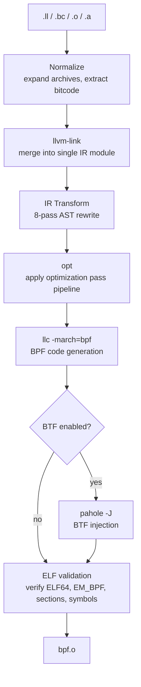
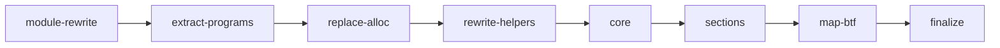

# Architecture

## Pipeline overview

`tinybpf` transforms TinyGo-emitted LLVM IR into a valid eBPF ELF object through a fixed sequence of stages. Each stage either invokes a standard LLVM binary or performs in-process IR rewriting, failing fast with a structured diagnostic on error.

### Stage details

| Stage | Input | Output | Cached | Error stage |
|-------|-------|--------|--------|-------------|
| Normalize | `.ll`, `.bc`, `.o`, `.a` | IR/bitcode paths | No | `input-normalization` |
| Link | Normalized IR | `01-linked.ll` | Yes | `llvm-link` |
| Transform | `01-linked.ll` | `02-transformed.ll` | Yes | `transform` |
| Opt | `02-transformed.ll` | `03-optimized.ll` | Yes | `opt` |
| Codegen | `03-optimized.ll` | `04-codegen.o` | Yes | `llc` |
| Finalize | `04-codegen.o` | output path | No | `finalize` |
| BTF | output ELF | output ELF (in-place) | No | `btf` |
| ELF validate | output ELF | *(validation only)* | No | `elf-validate` |

### Cache keys

Each cached stage computes a SHA-256 key from its inputs and tool configuration:

| Stage | Key components |
|-------|---------------|
| Link | `"link"` + file content hashes + `llvm-link` path |
| Transform | `"transform"` + linked IR hash + programs + sorted sections |
| Opt | `"opt"` + transformed IR hash + `opt` path + pass pipeline + profile + custom passes |
| Codegen | `"codegen"` + optimized IR hash + `llc` path + CPU flag |

Cache is stored under `$XDG_CACHE_HOME/tinybpf/v1/` in two-character hex shard directories. Tool paths are included (not versions) because the same path with an upgraded binary produces different output.

## IR transformation pipeline

TinyGo emits valid LLVM IR, but it targets the host architecture and carries Go runtime artifacts that the BPF verifier would reject. The 8-pass transformation bridges this gap, including automatic CO-RE (Compile Once -- Run Everywhere) support for `bpfCore`-prefixed struct types.

| Pass | Name | Consolidates | Purpose | Error behavior |
|------|------|--------------|---------|----------------|
| 1 | **module-rewrite** | retarget, strip-attributes | Replace `target datalayout` and `target triple` with BPF values; remove host-specific function attributes (`target-cpu`, `target-features`, `allockind`, etc.) | Fail-fast |
| 2 | **extract-programs** | -- | Keep only user program functions and their dependencies; discard TinyGo runtime (debug metadata preserved for BTF) | Fail-fast |
| 3 | **replace-alloc** | -- | Convert `@runtime.alloc` calls to entry-block `alloca` + `llvm.memset` | Collect-all |
| 4 | **rewrite-helpers** | -- | Convert mangled `@main.bpfXxx(args, ptr undef)` calls to `inttoptr (i64 ID to ptr)(args)` | Collect-all |
| 5 | **core** | rewrite-core-access, rewrite-core-exists, sanitize-core-fields | Replace getelementptr on `bpfCore` structs with preserve intrinsics; rewrite field/type existence calls; convert CamelCase metadata field names to snake_case (no-op without `bpfCore*` types) | Collect-all |
| 6 | **sections** | assign-data-sections, assign-program-sections | Place user-defined globals into `.data`/`.rodata`/`.bss`; apply BPF section attributes to functions and `.maps` to map globals; promote `internal` linkage to global | Fail-fast |
| 7 | **map-btf** | strip-map-prefix, rewrite-map-btf, sanitize-btf-names | Rename package-qualified map globals (`@main.events` -> `@events`); transform `bpfMapDef` globals to libbpf-compatible BTF encoding; replace `.` with `_` in type names | Collect-all |
| 8 | **finalize** | add-license, cleanup | Inject `license` section with `"GPL"` if not present; remove orphaned declares, unreferenced globals, and stale attribute groups | Fail-fast |

**Error behavior**: Passes marked "collect-all" accumulate all errors in a single traversal and return them together, so the user sees every problem at once. Passes marked "fail-fast" stop on the first error because their failures cascade.

Each pass receives a parsed `*ir.Module` and modifies the AST in place.

## Design decisions

### Shell out to LLVM binaries

The linker drives standalone LLVM tools (`llvm-link`, `opt`, `llc`) rather than linking against `libLLVM`. This avoids a CGo dependency on a specific LLVM version. Users install whichever LLVM matches their TinyGo, and the Go binary stays small, portable, and easy to cross-compile.

### AST-based IR transformation

The `ir` package provides a lightweight parser that builds a structured AST from LLVM IR text, covering the subset of IR that TinyGo emits: type definitions, globals, declares, functions (with basic blocks and instructions), attribute groups, and metadata nodes. The `transform` package operates on this AST, modifying nodes directly rather than manipulating raw text.

Unrecognized IR constructs are preserved verbatim through `Raw` fields on every AST node, guaranteeing faithful round-trip serialization (`Serialize(Parse(input)) == input` for unmodified modules). This avoids a CGo/libLLVM dependency, works across LLVM versions, and gives transforms structured access to functions, instructions, globals, and metadata without relying on fragile textual patterns.

### Fail-loud on partial match

Every transform that uses a two-stage filter (marker string check followed by regex or parser) **must** error when the marker is present but the second stage fails. A line containing `@main.bpf` inside a `call` that doesn't match the helper regex, a `bpfMapDef` global with an unparseable initializer, or a `bpfCore` GEP that doesn't match the expected pattern -- these all produce errors rather than silent skips.

The rule: if we recognize *what* a line is trying to do but can't parse *how*, that is an error, not a skip.

### Structured diagnostics

Every pipeline stage produces a `diag.Error` carrying the stage name, the command that failed, and a human-readable hint. LLVM tool errors can be cryptic; wrapping them with context makes debugging practical.

Transform passes that iterate independent items (helper rewrites, CO-RE access/exists, alloc replacement, map BTF) collect all errors in a single pass and return them as a `diag.Errors`. Structural stages (module rewrite, sections, finalize) remain fail-fast because their errors cascade.

Unknown BPF helper names include fuzzy-match suggestions ("did you mean?") based on Levenshtein distance against the generated helper table.

### Named optimization profiles

The `--opt-profile` flag maps to curated LLVM pass sequences tuned for BPF verifier compliance. See [Config Reference](config-reference.md#optimization-profiles) for the available profiles. Users who need full control can provide `--pass-pipeline` directly.

### Binary allowlist and environment sanitization

Every external binary execution passes through `llvm.Run`, which injects a minimal subprocess environment (`LC_ALL=C`, `TZ=UTC`, and only `PATH`/`HOME`/`TMPDIR` from the host). This prevents locale or timezone leaks from affecting LLVM output, supporting deterministic builds.

At tool discovery time, every resolved path is validated against an allowlist of known tool basenames (`llvm-link`, `opt`, `llc`, `llvm-ar`, `llvm-objcopy`, `pahole`, `tinygo`, `ld.lld`). Version-suffixed names like `opt-18` are accepted. Paths containing shell metacharacters are rejected.

### Project configuration

The `tinybpf.json` file stores project-level build settings. The CLI auto-discovers this file by walking parent directories from the current working directory, like `go.mod`. CLI flags override config file values for one-off invocations. See [Config Reference](config-reference.md) for the full schema and merge rules.

### Content-addressed build cache

The `cache` package provides a per-stage content-addressed build cache stored under `$XDG_CACHE_HOME/tinybpf/v1/`. On a cache hit, the cached output is copied directly to the working directory and the LLVM tool invocation is skipped.

Artifacts are stored in two-character hex shard directories. The `v1/` prefix allows future format changes without conflicting. BTF injection and ELF validation are not cached because they operate on the final output file and their cost is negligible compared to the LLVM tool stages.

### Input normalization

Archives (`.a`) and object files with embedded bitcode (`.o`) require extraction before linking. A dedicated normalization stage keeps the link step clean and makes supported input formats extensible. When multiple inputs are provided, `--jobs` enables parallel normalization bounded by a semaphore.

### Inspectable intermediates

The `--keep-temp` and `--tmpdir` flags preserve every intermediate file. The `--dump-ir` flag writes a snapshot of the IR after each transform pass into a `dump-ir/` subdirectory, numbered sequentially (`01-module-rewrite.ll`, `02-extract-programs.ll`, etc.), making it easy to diff consecutive passes and isolate which transform introduced a problem.

### Enriched error context

Transform-stage errors include the IR line number and a source snippet surrounding the failing line. For example, an unknown BPF helper error shows the exact IR call instruction and its neighbors, rather than just a function name.
