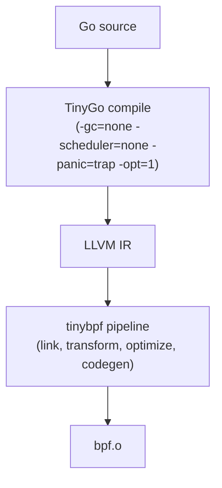

# Getting Started

This guide walks you through installing `tinybpf`, building your first BPF object, and loading it into a running Linux kernel.

## Prerequisites

| Dependency | Version | Required | Purpose |
|------------|---------|----------|---------|
| Go | 1.24+ | Yes | Build `tinybpf` and userspace loaders |
| TinyGo | 0.40+ | Yes | Compile Go to LLVM IR |
| `llvm-link` | 20+ | Yes | Link IR modules |
| `opt` | 20+ | Yes | Optimization pass pipeline |
| `llc` | 20+ | Yes | BPF code generation |
| `llvm-ar` | 20+ | For `.a` inputs | Expand archive inputs |
| `llvm-objcopy` | 20+ | For `.o` inputs | Extract embedded bitcode |
| `pahole` | | For `--btf` | BTF metadata injection |

System LLVM must be >= the major version bundled with TinyGo (TinyGo 0.40.x bundles LLVM 20).

### Platform notes

- **Linux**: Full support -- compile and load BPF programs.
- **macOS**: Compile only. The pipeline through `llc` works, but loading programs into the kernel requires Linux. Use a QEMU VM for end-to-end testing (see [Contributing](../CONTRIBUTING.md#vm-workflow)).

## Installation

### Automated setup

```bash
git clone https://github.com/kyleseneker/tinybpf.git
cd tinybpf
make setup    # installs Go, TinyGo, LLVM, and tools for your OS
make doctor   # verify everything is working
```

### Install the CLI only

If you already have the prerequisites:

```bash
go install github.com/kyleseneker/tinybpf/cmd/tinybpf@latest
```

### Verify the toolchain

```bash
tinybpf doctor
```

`doctor` resolves each LLVM tool, prints its path and version, and warns if anything is missing or too old.

## Scaffold a project

```bash
tinybpf init my_probe
```

This creates:

```
tinybpf.json           Build config (output path, program-to-section mapping)
bpf/my_probe.go        BPF program source (compiled with TinyGo)
bpf/my_probe_stub.go   Build tag stub for standard Go tooling
Makefile               Runs tinybpf build
```

## Build

```bash
cd my_probe
make
```

Or directly:

```bash
tinybpf build --verbose ./bpf
```

The output is a BPF ELF object at `build/my_probe.bpf.o`.

## Generate Go loader code

```bash
make generate
```

Or directly:

```bash
tinybpf generate build/my_probe.bpf.o --package loader --output internal/loader/objects_bpf.go
```

This generates type-safe Go code with `Objects`, `Programs`, and `Maps` structs for loading your BPF object. Use the generated `Load()` function and attach the programs yourself:

```go
objs, err := loader.Load("build/my_probe.bpf.o")
if err != nil {
    log.Fatal(err)
}
defer objs.Close()

// Attach using the typed program reference:
kp, err := link.Kprobe("do_sys_openat2", objs.MyProbe, nil)
```

See [CLI Reference](cli-reference.md#generate) for all flags.

### What happens during a build



1. TinyGo compiles the Go package to LLVM IR with no runtime.
2. `tinybpf` links the IR, runs 8 transformation passes to make it BPF-compatible, optimizes with `opt`, and generates BPF bytecode with `llc`.
3. The result is a standard BPF ELF object.

See [Architecture](architecture.md) for the full pipeline breakdown.

## Validate the output

```bash
tinybpf verify --input build/my_probe.bpf.o
```

This checks that the output is a valid BPF ELF: 64-bit, `EM_BPF` machine type, at least one executable program section, `.maps` section is not executable, and valid symbols.

## Load into the kernel

`tinybpf` produces the BPF object file. Loading it into the kernel is done by a separate loader. The examples use [`cilium/ebpf`](https://github.com/cilium/ebpf), but [`libbpf`](https://github.com/libbpf/libbpf) and [`bpftool`](https://github.com/libbpf/bpftool) work too.

Quick test with `bpftool` (requires root on Linux):

```bash
sudo bpftool prog load build/my_probe.bpf.o /sys/fs/bpf/my_probe
sudo bpftool prog show name my_probe
sudo rm /sys/fs/bpf/my_probe
```

## Next steps

- [Examples Guide](examples.md) -- run working programs and learn by example
- [Writing Go for eBPF](writing-go-for-ebpf.md) -- language constraints, helpers, and patterns
- [CLI Reference](cli-reference.md) -- every flag and option
- [Config Reference](config-reference.md) -- `tinybpf.json` schema and merge rules
- [Troubleshooting](troubleshooting.md) -- when things go wrong
