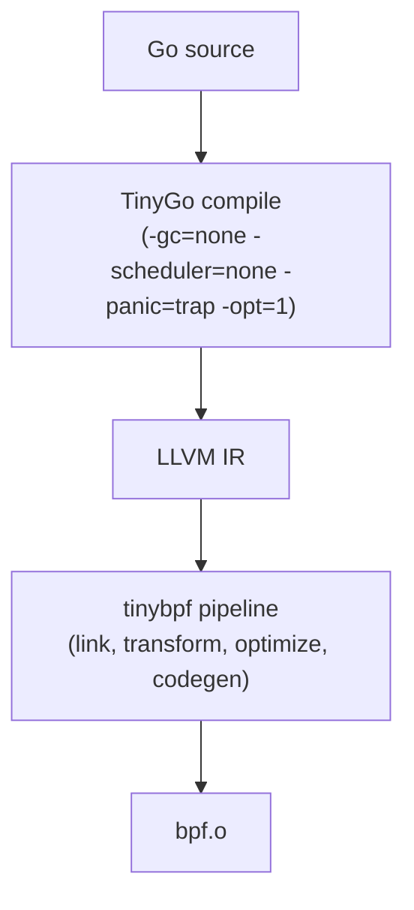

# Getting Started

This guide walks you through installing `tinybpf`, writing a BPF program in Go, compiling it, generating a typed loader, and loading it into the kernel.

## Prerequisites

| Dependency | Version | Required | Purpose |
|------------|---------|----------|---------|
| Go | 1.24+ | Yes | Build `tinybpf` and userspace loaders |
| TinyGo | 0.40+ | Yes | Compile Go to LLVM IR |
| `llvm-link` | 20+ | Yes | Link IR modules |
| `opt` | 20+ | Yes | Optimization pass pipeline |
| `llc` | 20+ | Yes | BPF code generation |
| `llvm-ar` | 20+ | For `.a` inputs | Expand archive inputs |
| `llvm-objcopy` | 20+ | For `.o` inputs | Extract embedded bitcode |
| `pahole` | | For `--btf` | BTF metadata injection |

System LLVM must be >= the major version bundled with TinyGo (TinyGo 0.40.x bundles LLVM 20).

### Platform notes

- **Linux**: Full support -- compile and load BPF programs.
- **macOS**: Compile only. The pipeline through `llc` works, but loading programs into the kernel requires Linux. Use a QEMU VM for end-to-end testing (see [Contributing](../CONTRIBUTING.md#vm-workflow)).

## Install

### Automated setup

```bash
git clone https://github.com/kyleseneker/tinybpf.git
cd tinybpf
make setup    # installs Go, TinyGo, LLVM, and tools for your OS
make doctor   # verify everything is working
```

### Install the CLI only

If you already have the prerequisites:

```bash
go install github.com/kyleseneker/tinybpf/cmd/tinybpf@latest
```

### Verify the toolchain

```bash
tinybpf doctor
```

`doctor` resolves each LLVM tool, prints its path and version, and warns if anything is missing or too old.

## 1. Scaffold a project

```bash
tinybpf init my_probe
cd my_probe
```

This creates:

```
tinybpf.json           Build config (output path, program-to-section mapping)
bpf/my_probe.go        BPF program source (compiled with TinyGo)
bpf/my_probe_stub.go   Build tag stub for standard Go tooling
Makefile               Build and generate targets
```

## 2. Write your BPF program

Edit `bpf/my_probe.go`. The scaffold generates a minimal program; here is a kprobe that captures the current PID:

```go
//go:build tinygo

package main

import "unsafe"

type bpfMapDef struct {
    Type       uint32
    KeySize    uint32
    ValueSize  uint32
    MaxEntries uint32
    MapFlags   uint32
}

var events = bpfMapDef{Type: 27, MaxEntries: 1 << 24} // ring buffer

//go:extern bpf_get_current_pid_tgid
func bpfGetCurrentPidTgid() uint64

//go:extern bpf_ringbuf_output
func bpfRingbufOutput(rb unsafe.Pointer, data unsafe.Pointer, size uint64, flags uint64) int64

//export my_probe
func my_probe(ctx unsafe.Pointer) int32 {
    pid := uint32(bpfGetCurrentPidTgid() >> 32)
    bpfRingbufOutput(unsafe.Pointer(&events), unsafe.Pointer(&pid), 4, 0)
    return 0
}

func main() {}
```

Set the ELF section in `tinybpf.json` so the loader knows how to attach:

```json
{
  "build": {
    "output": "build/my_probe.bpf.o",
    "programs": {
      "my_probe": "kprobe/do_sys_openat2"
    }
  }
}
```

See [Writing Go for eBPF](writing-go-for-ebpf.md) for the full language subset, helper list, and CO-RE patterns.

## 3. Build

```bash
make build
```

Or directly:

```bash
tinybpf build --verbose ./bpf
```

### What happens during a build



1. TinyGo compiles the Go package to LLVM IR with no runtime.
2. `tinybpf` links the IR, runs 8 transformation passes to make it BPF-compatible, optimizes with `opt`, and generates BPF bytecode with `llc`.
3. The result is a standard BPF ELF object at `build/my_probe.bpf.o`.

See [Architecture](architecture.md) for the full pipeline breakdown.

## 4. Generate a typed loader

```bash
make generate
```

Or directly:

```bash
tinybpf generate build/my_probe.bpf.o --package loader --output internal/loader/objects_bpf.go
```

This reads the compiled ELF and generates Go code with typed structs for every program and map:

```go
// Code generated by tinybpf; DO NOT EDIT.
package loader

type Objects struct {
    Programs
    Maps
}

type Programs struct {
    MyProbe *ebpf.Program `ebpf:"my_probe"`
}

type Maps struct {
    Events *ebpf.Map `ebpf:"events"`
}

func Load(objectPath string) (*Objects, error) { ... }
```

No more `coll.Programs["my_probe"]` string lookups. No more `firstProgram(coll)` iteration. The generated `Load()` uses cilium/ebpf's `LoadAndAssign()` to populate everything in one call.

See [CLI Reference](cli-reference.md#generate) for all flags.

## 5. Load into the kernel

Write a `main.go` that uses the generated loader and attaches the program:

```go
package main

import (
    "fmt"
    "log"
    "os"
    "os/signal"
    "syscall"

    "my_probe/internal/loader"
    "github.com/cilium/ebpf/link"
)

func main() {
    objs, err := loader.Load("build/my_probe.bpf.o")
    if err != nil {
        log.Fatal(err)
    }
    defer objs.Close()

    kp, err := link.Kprobe("do_sys_openat2", objs.MyProbe, nil)
    if err != nil {
        log.Fatal(err)
    }
    defer kp.Close()

    fmt.Println("attached kprobe -- press Ctrl+C to exit")
    sig := make(chan os.Signal, 1)
    signal.Notify(sig, os.Interrupt, syscall.SIGTERM)
    <-sig
}
```

Run it:

```bash
go build -o build/tracer ./cmd/tracer
sudo ./build/tracer
```

### Quick test with bpftool

You can also verify the object loads without writing any Go:

```bash
sudo bpftool prog load build/my_probe.bpf.o /sys/fs/bpf/my_probe
sudo bpftool prog show name my_probe
sudo rm /sys/fs/bpf/my_probe
```

## 6. Validate the output (optional)

```bash
tinybpf verify --input build/my_probe.bpf.o
```

Checks that the output is a valid BPF ELF: 64-bit, `EM_BPF` machine type, executable program sections, and valid symbols.

## Next steps

- [Examples Guide](examples.md) -- 9 working programs across tracing, networking, and security
- [Writing Go for eBPF](writing-go-for-ebpf.md) -- language constraints, helpers, CO-RE, and kfuncs
- [CLI Reference](cli-reference.md) -- every flag and option
- [Config Reference](config-reference.md) -- `tinybpf.json` schema and merge rules
- [Troubleshooting](troubleshooting.md) -- when things go wrong
