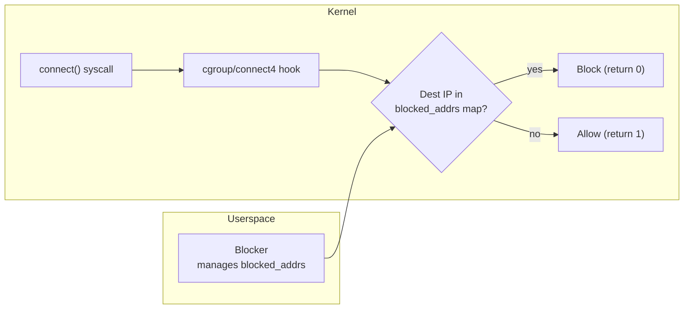

# cgroup-connect

A cgroup/connect4 connection blocker written entirely in Go, built with `tinybpf`.

This example demonstrates the full lifecycle: writing an eBPF cgroup program in Go, compiling it through TinyGo and `tinybpf`, loading it into the kernel with [`cilium/ebpf`](https://github.com/cilium/ebpf), and blocking outbound IPv4 TCP connections from userspace.

## Overview

The program attaches to a cgroup at the `connect4` hook. On every outbound IPv4 TCP connection attempt, it reads the destination address from the `bpf_sock_addr` context, looks it up in a BPF hash map, and returns `0` (block) if found or `1` (allow) otherwise. The Go userspace program populates the blocklist and keeps the program attached until interrupted.



## Project layout

```
bpf/
  connect.go             eBPF cgroup program source (compiled with TinyGo)
  connect_stub.go        Build tag placeholder for standard Go tooling
cmd/blocker/
  main.go                Userspace entry point (load, attach, manage map)
internal/
  loader/                ELF loading and cgroup attachment (cilium/ebpf)
scripts/
  build.sh               TinyGo + tinybpf build pipeline
  run.sh                 Build and run (requires root)
```

## Prerequisites

- Linux host with cgroup v2 and BPF support
- Go 1.24+
- TinyGo 0.40+
- LLVM tools (`llvm-link`, `opt`, `llc`) version 20+
- Root privileges or `CAP_BPF` + `CAP_NET_ADMIN`

## Build

```bash
./scripts/build.sh
```

Produces `build/connect.bpf.o`. The build is configurable via environment variables:

| Variable | Default | Description |
|----------|---------|-------------|
| `TINYBPF_BIN` | *(built from source)* | Path to `tinybpf` binary |
| `BPF_CPU` | `v3` | BPF CPU version for `llc -mcpu` |

## Run

```bash
# Block connections to example.com (93.184.216.34)
sudo ./scripts/run.sh

# Block a different IP
sudo BLOCK_IP=10.0.0.1 ./scripts/run.sh
```

The program stays attached until you press Ctrl+C.

## Testing

While the blocker is running, verify that connections to the blocked IP are rejected:

```bash
# This should fail (connection refused or timeout)
curl -m 5 http://example.com

# Other connections should still work
curl -m 5 http://google.com
```

## Troubleshooting

| Symptom | Resolution |
|---------|------------|
| No program found / attach failure | Verify TinyGo output contains the `cgroup/connect4` section. Ensure cgroup v2 is mounted: `mount | grep cgroup2` |
| Permission denied | Run as root or grant `CAP_BPF` and `CAP_NET_ADMIN` capabilities |
| Connections not blocked | Verify the map has entries: `sudo bpftool map dump name blocked_addrs` |
| Toolchain errors | Run `tinybpf doctor` to diagnose |
