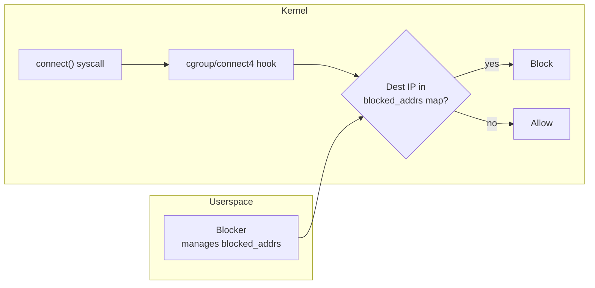

# cgroup-connect

Blocks outbound IPv4 TCP connections via the `cgroup/connect4` hook. Reads the destination address from `bpf_sock_addr`, looks it up in a hash map, and returns block or allow. The Go userspace program populates the blocklist.


```mermaid
graph LR
    subgraph Kernel
        A["connect() syscall"] --> B["cgroup/connect4 hook"]
        B --> C{"Dest IP in<br>blocked_addrs map?"}
        C -- yes --> D["Block"]
        C -- no --> E["Allow"]
    end
    subgraph Userspace
        F["Blocker<br>manages blocked_addrs"] --> C
    end
```

**Concepts:** cgroup hook, hash map, connection policy (allow/deny)

## Prerequisites

- Linux with cgroup v2 and BPF support
- Root or `CAP_BPF` + `CAP_NET_ADMIN`
- [Toolchain requirements](../../docs/getting-started.md#prerequisites)

## Build and run

```bash
./scripts/build.sh

# Block connections to example.com (93.184.216.34)
sudo ./scripts/run.sh

# Block a different IP
sudo BLOCK_IP=10.0.0.1 ./scripts/run.sh
```

The program stays attached until you press Ctrl+C.

## Testing

While the blocker is running:

```bash
# This should fail (connection refused or timeout)
curl -m 5 http://example.com

# Other connections should still work
curl -m 5 http://google.com
```

## Troubleshooting

| Symptom | Resolution |
|---------|------------|
| Attach failure | Ensure cgroup v2 is mounted: `mount \| grep cgroup2` |
| Permission denied | Run as root or grant `CAP_BPF` + `CAP_NET_ADMIN` |
| Connections not blocked | Verify map has entries: `sudo bpftool map dump name blocked_addrs` |
| Build errors | Run `tinybpf doctor` |

See [Troubleshooting](../../docs/troubleshooting.md) for general guidance.
