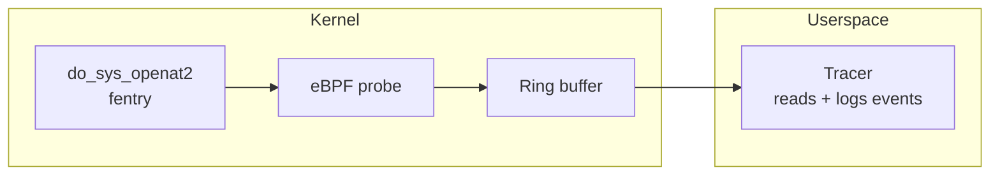

# fentry-open

An eBPF fentry (function entry tracing) program written entirely in Go, built with `tinybpf`.

This example demonstrates the full lifecycle: writing an eBPF fentry probe in Go, compiling it through TinyGo and `tinybpf`, loading it into the kernel with [`cilium/ebpf`](https://github.com/cilium/ebpf), and reading live events from userspace.

## Overview

The probe attaches to `fentry/do_sys_openat2`. On every invocation, it reads the calling process's PID and the filename argument, writes an event to an eBPF ring buffer, and a Go userspace program reads and logs each event.



Requires kernel 5.5+ with BTF support.

## Project layout

```
bpf/
  open.go                   eBPF probe source (compiled with TinyGo)
  open_stub.go              Build tag placeholder for standard Go tooling
cmd/tracer/
  main.go                   Userspace entry point
internal/
  loader/                   ELF loading and fentry attachment (cilium/ebpf)
  reader/                   Ring buffer read loop and event formatting
  event/                    Event struct and binary decoding
scripts/
  build.sh                  TinyGo + tinybpf build pipeline
  run.sh                    Build and run (requires root)
```

## Prerequisites

- Linux host with BTF support (kernel 5.5+)
- Go 1.24+
- TinyGo 0.40+
- LLVM tools (`llvm-link`, `opt`, `llc`) version 20+
- Root privileges or `CAP_BPF` + `CAP_PERFMON`

## Build

```bash
./scripts/build.sh
```

Produces `build/open.bpf.o`. The build is configurable via environment variables:

| Variable | Default | Description |
|----------|---------|-------------|
| `TINYBPF_BIN` | *(built from source)* | Path to `tinybpf` binary |
| `BPF_CPU` | `v3` | BPF CPU version for `llc -mcpu` |

## Run

```bash
sudo ./scripts/run.sh
```

In another terminal, trigger file opens:

```bash
cat /etc/hostname
```

Expected output:

```
2026-02-21T12:34:56Z pid=1234 file=/etc/hostname
```

## Troubleshooting

| Symptom | Resolution |
|---------|------------|
| No program found / attach failure | Verify BTF is enabled: `ls /sys/kernel/btf/vmlinux`. Check that `do_sys_openat2` is available: `bpftool btf dump file /sys/kernel/btf/vmlinux format c \| grep do_sys_openat2` |
| Permission denied | Run as root or grant `CAP_BPF` and `CAP_PERFMON` capabilities |
| No events logged | Check that file opens are occurring. Verify tracer stderr for ring buffer or decode errors |
| Kernel too old | fentry requires kernel 5.5+ with BTF. Run `uname -r` to check |
| Toolchain errors | Run `tinybpf doctor` to diagnose |
