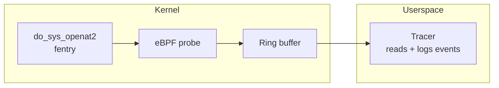

# fentry-open

Traces file opens via an fentry probe on `do_sys_openat2`. Captures PID and filename, writes events to a ring buffer, and logs them from userspace. Requires kernel 5.5+ with BTF support.


```mermaid
graph LR
    subgraph Kernel
        A["do_sys_openat2<br>fentry"] --> B["eBPF probe"]
        B --> C["Ring buffer"]
    end
    subgraph Userspace
        C --> D["Tracer<br>reads + logs events"]
    end
```

**Concepts:** fentry (BTF-based tracing), ring buffer, kernel 5.5+ requirement

## Prerequisites

- Linux with BTF support (kernel 5.5+)
- Root or `CAP_BPF` + `CAP_PERFMON`
- [Toolchain requirements](../../docs/getting-started.md#prerequisites)

## Build and run

```bash
./scripts/build.sh
sudo ./scripts/run.sh
```

Trigger file opens in another terminal:

```bash
cat /etc/hostname
```

Expected output:

```
2026-02-21T12:34:56Z pid=1234 file=/etc/hostname
```

## Troubleshooting

| Symptom | Resolution |
|---------|------------|
| Attach failure | Verify BTF is enabled: `ls /sys/kernel/btf/vmlinux`. Check `do_sys_openat2` is available: `bpftool btf dump file /sys/kernel/btf/vmlinux format c \| grep do_sys_openat2` |
| Permission denied | Run as root or grant `CAP_BPF` + `CAP_PERFMON` |
| No events | Trigger file opens and check tracer stderr |
| Kernel too old | fentry requires kernel 5.5+ with BTF. Run `uname -r` to check. |
| Build errors | Run `tinybpf doctor` |

See [Troubleshooting](../../docs/troubleshooting.md) for general guidance.
