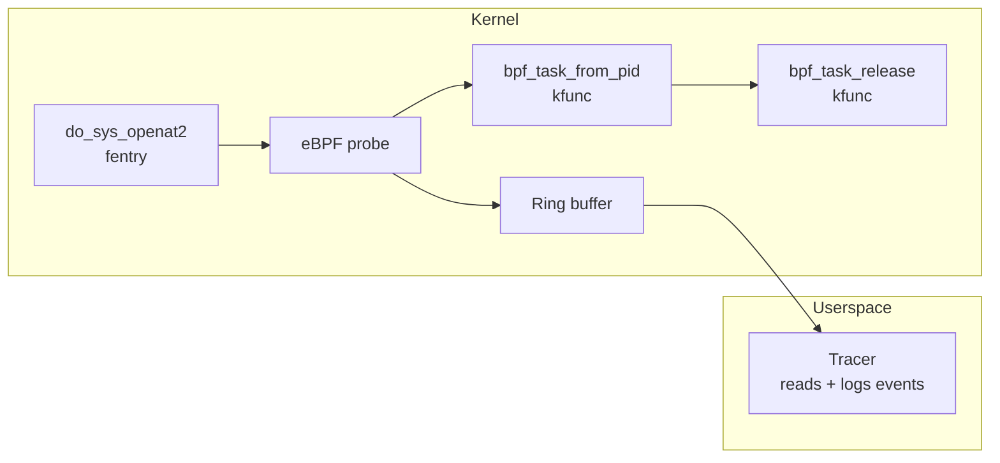

# kfunc-task

Demonstrates calling a pair of BPF **kfuncs** -- `bpf_task_from_pid` and `bpf_task_release` -- from a Go-authored fentry probe. The program hooks `do_sys_openat2`, looks up the calling task by its PID via the kernel kfunc, and emits `{pid, found}` events to userspace over a ring buffer.



**Concepts:** kfuncs, BTF-based resolution, acquire/release reference semantics, ring buffer

## What is a kfunc?

Kfuncs are kernel functions exposed to BPF programs and resolved by the loader via kernel BTF rather than the fixed helper-ID table. They extend BPF beyond the ~211 numbered helpers and are the standard way modern kernel features (cgroup, task, dynptr, iterators, ...) are surfaced to BPF.

In tinybpf, kfuncs use a naming convention:

```go
//go:extern bpf_task_from_pid
func bpfKfuncBpfTaskFromPid(pid int32) unsafe.Pointer

//go:extern bpf_task_release
func bpfKfuncBpfTaskRelease(task unsafe.Pointer)
```

The transform pipeline recognises the `bpfKfunc` prefix, keeps the declaration as an extern (instead of rewriting it to a helper ID), and strips the trailing TinyGo context pointer from the call. The BPF loader (`cilium/ebpf` in this example) then resolves the extern against kernel BTF at load time.

See [Writing Go for eBPF: kfuncs](../../docs/writing-go-for-ebpf.md#kfuncs-kernel-functions) for details.

## Why these two kfuncs?

- `bpf_task_from_pid(pid) -> struct task_struct *` is a well-documented, `KF_ACQUIRE`-tagged kfunc that returns a referenced pointer or NULL.
- `bpf_task_release(task)` releases that reference. The verifier rejects programs that leak it.

This pair is the simplest credible kfunc use-case: one acquire, one release, no iteration, no intermediate state.

## Prerequisites

- Linux with BTF support and kernel **6.1+** (where `bpf_task_from_pid` became available; check `bpftool btf dump file /sys/kernel/btf/vmlinux format c | grep bpf_task_from_pid`)
- Root or `CAP_BPF` + `CAP_PERFMON`
- [Toolchain requirements](../../docs/getting-started.md#prerequisites)

## Build and run

```bash
./scripts/build.sh
sudo ./scripts/run.sh
```

Trigger file opens in another terminal:

```bash
cat /etc/hostname
```

Expected output:

```
2026-04-16T12:34:56Z pid=1234 task_found=1
```

`task_found=1` means the kfunc successfully resolved the current PID to a task struct. `task_found=0` would indicate the PID had already exited by the time the probe ran -- rare but possible under races.

## Troubleshooting

| Symptom | Resolution |
|---------|------------|
| `load BPF spec: ... unknown func bpf_task_from_pid` | Kernel is older than 6.1 or lacks the kfunc. Check `bpftool btf dump file /sys/kernel/btf/vmlinux format c \| grep bpf_task_from_pid` |
| `permission denied` at load | Run as root or grant `CAP_BPF` + `CAP_PERFMON` |
| Verifier rejects `reference not released` | The program must call `bpf_task_release` on every non-NULL return. The source does this; regressions here will be caught by the verifier. |
| Attach failure on `do_sys_openat2` | Different kernels expose different openat symbols. Check `ls /sys/kernel/tracing/events/syscalls/` or switch to `fentry/__x64_sys_openat`. |

See [Troubleshooting](../../docs/troubleshooting.md) for general guidance.

## Status

tinybpf's kfunc support is limited to extern preservation and prefix stripping (see the transform passes under `internal/transform/`). The compiled ELF relies on the loader's BTF-based kfunc resolution. This example is the first end-to-end validation of that path.
