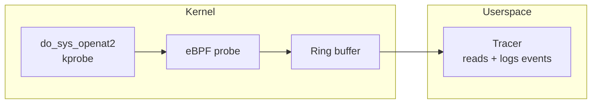

# kprobe-openat

A kprobe that traces `openat` system calls, written entirely in Go, built with `tinybpf`.

This example demonstrates the full lifecycle: writing an eBPF kprobe in Go, compiling it through TinyGo and `tinybpf`, loading it into the kernel with [`cilium/ebpf`](https://github.com/cilium/ebpf), and reading live events from userspace.

## Overview

The probe attaches to the `do_sys_openat2` kernel function. On each invocation it captures the calling process's PID, UID, command name, open flags, and the filename being opened. Events are written to a BPF ring buffer and a Go userspace program reads and logs each event.



## Project layout

```
bpf/
  openat.go              eBPF probe source (compiled with TinyGo)
  openat_stub.go         Build tag placeholder for standard Go tooling
cmd/tracer/
  main.go                Userspace entry point
internal/
  loader/                ELF loading and kprobe attachment (cilium/ebpf)
  reader/                Ring buffer read loop and event formatting
  event/                 Event struct and binary decoding
scripts/
  build.sh               TinyGo + tinybpf build pipeline
  run.sh                 Build and run (requires root)
  smoke.sh               Automated smoke test
```

## Prerequisites

- Linux host with BPF and kprobe support
- Go 1.24+
- TinyGo 0.40+
- LLVM tools (`llvm-link`, `opt`, `llc`) version 20+
- Root privileges or `CAP_BPF` + `CAP_PERFMON`

## Build

```bash
./scripts/build.sh
```

Produces `build/openat.bpf.o`. The build is configurable via environment variables:

| Variable | Default | Description |
|----------|---------|-------------|
| `TINYBPF_BIN` | *(built from source)* | Path to `tinybpf` binary |
| `BPF_CPU` | `v3` | BPF CPU version for `llc -mcpu` |

## Run

```bash
sudo ./scripts/run.sh
```

In another terminal, trigger file opens:

```bash
cat /etc/hosts
```

Expected output:

```
2026-02-21T12:34:56Z pid=1234 uid=1000 flags=0x0 comm=cat file=/etc/hosts
```

## Smoke test

```bash
sudo ./scripts/smoke.sh
```

Builds the ELF object, runs the tracer, triggers a file open, and asserts that at least one open event is logged.

## Notes

- The `ptRegs` struct layout is architecture-specific. The example targets arm64; adjust register offsets for amd64.
- Check available kprobe targets: `cat /sys/kernel/debug/tracing/available_filter_functions | grep openat`

## Troubleshooting

| Symptom | Resolution |
|---------|------------|
| No program found / attach failure | Verify `do_sys_openat2` exists in available_filter_functions. Older kernels may use `do_sys_open` instead. |
| Permission denied | Run as root or grant `CAP_BPF` and `CAP_PERFMON` capabilities |
| No events logged | Trigger a file open (e.g. `cat /etc/hosts`) and check tracer stderr for errors |
| Toolchain errors | Run `tinybpf doctor` to diagnose |
