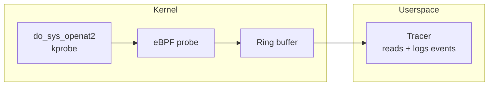

# kprobe-openat

Traces `openat` system calls via a kprobe on `do_sys_openat2`. Captures PID, UID, command name, flags, and filename. Events are written to a ring buffer and logged from userspace.


```mermaid
graph LR
    subgraph Kernel
        A["do_sys_openat2<br>kprobe"] --> B["eBPF probe"]
        B --> C["Ring buffer"]
    end
    subgraph Userspace
        C --> D["Tracer<br>reads + logs events"]
    end
```

**Concepts:** kprobe, `pt_regs` context, architecture-specific register offsets, ring buffer

## Prerequisites

- Linux with kprobe support
- Root or `CAP_BPF` + `CAP_PERFMON`
- [Toolchain requirements](../../docs/getting-started.md#prerequisites)

## Build and run

```bash
./scripts/build.sh
sudo ./scripts/run.sh
```

Trigger file opens in another terminal:

```bash
cat /etc/hosts
```

Expected output:

```
2026-02-21T12:34:56Z pid=1234 uid=1000 flags=0x0 comm=cat file=/etc/hosts
```

## Smoke test

```bash
sudo ./scripts/smoke.sh
```

## Notes

- The `ptRegs` struct layout is architecture-specific. This example targets arm64; adjust register offsets for amd64.
- Check available kprobe targets: `cat /sys/kernel/debug/tracing/available_filter_functions | grep openat`

## Troubleshooting

| Symptom | Resolution |
|---------|------------|
| Attach failure | Verify `do_sys_openat2` exists in `available_filter_functions`. Older kernels may use `do_sys_open`. |
| Permission denied | Run as root or grant `CAP_BPF` + `CAP_PERFMON` |
| No events | Trigger a file open and check tracer stderr |
| Build errors | Run `tinybpf doctor` |

See [Troubleshooting](../../docs/troubleshooting.md) for general guidance.
