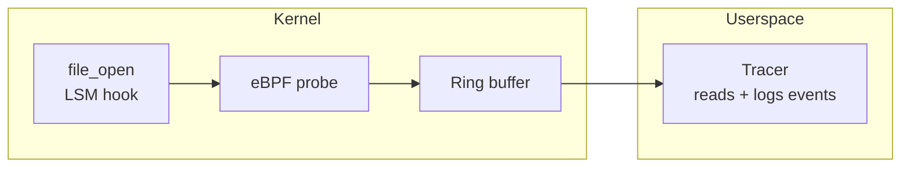

# lsm-file-open

Audits every file open on the system using a BPF LSM (Linux Security Module) hook. Captures PID, UID, and command name, writes events to a ring buffer, and logs them from userspace.



**Concepts:** LSM hooks, security auditing, ring buffer, `CONFIG_BPF_LSM`

## Prerequisites

- Linux with BPF LSM enabled (kernel 5.7+, `CONFIG_BPF_LSM=y`, `bpf` in `lsm=` boot parameter)
- Root or `CAP_BPF` + `CAP_MAC_ADMIN`
- [Toolchain requirements](../../docs/getting-started.md#prerequisites)

### Enabling BPF LSM

Most distributions do not enable BPF LSM by default. Check and enable:

```bash
# Check current LSM list
cat /sys/kernel/security/lsm

# Add bpf to the boot parameter (GRUB)
# Edit /etc/default/grub, add to GRUB_CMDLINE_LINUX:
#   lsm=lockdown,capability,landlock,yama,bpf
sudo update-grub && sudo reboot
```

## Build and run

```bash
./scripts/build.sh
sudo ./scripts/run.sh
```

Trigger file opens in another terminal:

```bash
cat /etc/hostname
```

Expected output:

```
2026-01-15T10:30:00Z pid=1234 uid=1000 comm=cat
```

## Troubleshooting

| Symptom | Resolution |
|---------|------------|
| `attach LSM: invalid argument` | Kernel lacks `CONFIG_BPF_LSM=y` or `bpf` not in `lsm=` boot parameter |
| Permission denied | Run as root or grant `CAP_BPF` + `CAP_MAC_ADMIN` |
| No events | Trigger file opens and check tracer stderr |
| Build errors | Run `tinybpf doctor` |

See [Troubleshooting](../../docs/troubleshooting.md) for general guidance.
