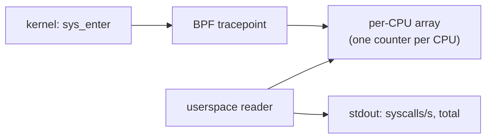

# percpu-counter

Counts syscalls per CPU using a per-CPU array map, demonstrating lock-free high-throughput counting with eBPF.



## What it does

The BPF program attaches to `raw_syscalls/sys_enter` and increments a counter in a per-CPU array map on every syscall. Each CPU maintains its own copy of the counter, so there is no lock contention on the hot path. The userspace reader aggregates across CPUs and reports the syscall rate once per second.

Per-CPU maps are the standard pattern for high-throughput counters in production eBPF tools (Cilium, Pixie, bpftrace).

## Prerequisites

| Requirement | Details |
|-------------|---------|
| Kernel | 4.15+ |
| Capabilities | `CAP_BPF` (or root) |
| Toolchain | TinyGo 0.40+, LLVM 20+, tinybpf |

## Build

```bash
make example NAME=percpu-counter
```

## Run

```bash
sudo ./examples/percpu-counter/scripts/run.sh
```

Expected output:

```
attached tracepoint raw_syscalls/sys_enter from build/counter.bpf.o
press Ctrl+C to stop
2025-01-15T10:30:01Z syscalls/s=48523 total=48523 cpus=8
2025-01-15T10:30:02Z syscalls/s=51204 total=99727 cpus=8
2025-01-15T10:30:03Z syscalls/s=47891 total=147618 cpus=8
```

## Troubleshooting

| Symptom | Fix |
|---------|-----|
| `attach tracepoint: no such file` | Kernel lacks `raw_syscalls/sys_enter`; check `ls /sys/kernel/tracing/events/raw_syscalls/` |
| `lookup error` | Ensure the BPF object loaded correctly |
| Rate shows 0 | The first reading has no previous baseline; wait for the second tick |
