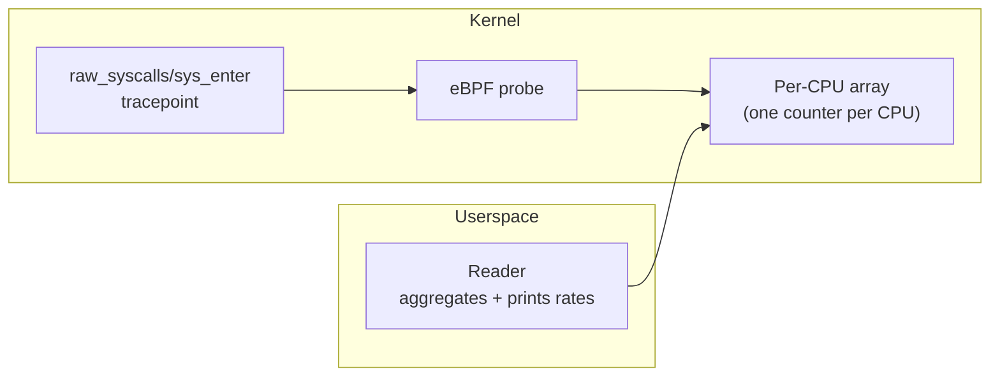

# percpu-counter

Counts syscalls per CPU using a per-CPU array map, reporting per-second rates from userspace. Demonstrates lock-free high-throughput counting without atomic operations.



**Concepts:** per-CPU array map, lock-free counting, tracepoint, userspace map aggregation

## Prerequisites

- Linux kernel 4.15+
- Root or `CAP_BPF`
- [Toolchain requirements](../../docs/getting-started.md#prerequisites)

## Build and run

```bash
./scripts/build.sh
sudo ./scripts/run.sh
```

Expected output:

```
2026-01-15T10:30:01Z syscalls/s=48523 total=48523 cpus=8
2026-01-15T10:30:02Z syscalls/s=51204 total=99727 cpus=8
```

## Troubleshooting

| Symptom | Resolution |
|---------|------------|
| `attach tracepoint: no such file` | Kernel lacks `raw_syscalls/sys_enter`. Check `ls /sys/kernel/tracing/events/raw_syscalls/` |
| `lookup error` | Ensure the BPF object loaded correctly |
| Rate shows 0 | First reading has no previous baseline; wait for the second tick |
| Build errors | Run `tinybpf doctor` |

See [Troubleshooting](../../docs/troubleshooting.md) for general guidance.
