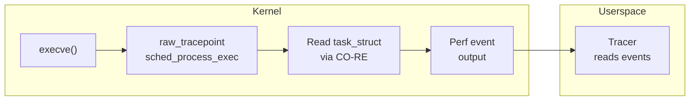

# rawtp-sched

A raw tracepoint exec tracer written entirely in Go, built with `tinybpf`.

This example demonstrates the full lifecycle: writing a CO-RE portable eBPF program in Go, compiling it through TinyGo and `tinybpf`, loading it into the kernel with [`cilium/ebpf`](https://github.com/cilium/ebpf), and reading exec events from userspace.

## Overview

The program attaches to the `sched_process_exec` raw tracepoint. On every `execve`, it reads the pid and tgid from the current task using CO-RE portable struct access, captures the process comm, and emits an event through a perf event array to userspace.



## Project layout

```
bpf/
  sched.go               eBPF raw tracepoint program source (compiled with TinyGo)
  sched_stub.go           Build tag placeholder for standard Go tooling
cmd/tracer/
  main.go                Userspace entry point (load, attach, read events)
internal/
  loader/                ELF loading and raw tracepoint attachment (cilium/ebpf)
scripts/
  build.sh               TinyGo + tinybpf build pipeline
```

## Prerequisites

- Linux host with raw tracepoint support (kernel 4.17+)
- Go 1.24+
- TinyGo 0.40+
- LLVM tools (`llvm-link`, `opt`, `llc`) version 20+
- Root privileges or `CAP_BPF`

## Build

```bash
./scripts/build.sh
```

Produces `build/sched.bpf.o`. The build is configurable via environment variables:

| Variable | Default | Description |
|----------|---------|-------------|
| `TINYBPF_BIN` | *(built from source)* | Path to `tinybpf` binary |
| `BPF_CPU` | `v3` | BPF CPU version for `llc -mcpu` |

## Run

```bash
sudo ./scripts/run.sh
```

The program stays attached until you press Ctrl+C.

## CO-RE portability

This example uses `bpfCoreTaskStruct` — a Go struct stub whose field offsets are resolved at load time via BTF relocations. `tinybpf` automatically detects `bpfCore*` types and emits `llvm.preserve.struct.access.index` intrinsics for these accesses, so the compiled program works across kernel versions without recompilation.

The program also demonstrates `bpfCoreFieldExists` — a compile-time relocation marker that checks whether a specific field exists in the running kernel's `task_struct`. This enables conditional access patterns that gracefully handle kernel version differences.

## Troubleshooting

| Symptom | Resolution |
|---------|------------|
| Attach failure | Check kernel version >= 4.17 for raw tracepoint support |
| Permission denied | Run as root or grant `CAP_BPF` |
| No events | Trigger an exec (e.g., `ls` in another terminal) while tracer is running |
| Toolchain errors | Run `tinybpf doctor` to diagnose |
