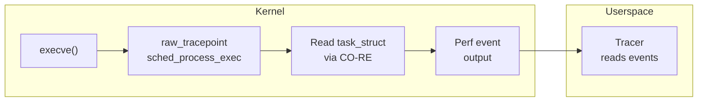

# rawtp-sched

Traces process execution via the `sched_process_exec` raw tracepoint. Uses CO-RE portable struct access to read PID and TGID from the current task, captures the process comm, and emits events through a perf event array.


```mermaid
graph LR
    subgraph Kernel
        A["execve()"] --> B["raw_tracepoint<br>sched_process_exec"]
        B --> C["Read task_struct<br>via CO-RE"]
        C --> D["Perf event<br>output"]
    end
    subgraph Userspace
        D --> E["Tracer<br>reads events"]
    end
```

**Concepts:** raw tracepoint, CO-RE (`bpfCoreTaskStruct`, `bpfCoreFieldExists`), perf event array

## Prerequisites

- Linux with raw tracepoint support (kernel 4.17+) and BTF (`CONFIG_DEBUG_INFO_BTF=y`)
- Root or `CAP_BPF` + `CAP_PERFMON`
- [Toolchain requirements](../../docs/getting-started.md#prerequisites)

## Build and run

```bash
./scripts/build.sh
sudo ./scripts/run.sh
```

Trigger exec events in another terminal:

```bash
ls
```

Expected output:

```
2026-01-15T10:30:00Z pid=1234 tgid=1234 comm=ls
```

## CO-RE portability

This example uses `bpfCoreTaskStruct` -- a Go struct stub whose field offsets are resolved at load time via BTF relocations. `tinybpf` automatically detects `bpfCore*` types and emits `llvm.preserve.struct.access.index` intrinsics, so the compiled program works across kernel versions without recompilation.

The program also demonstrates `bpfCoreFieldExists` -- a compile-time relocation marker that checks whether a specific field exists in the running kernel's `task_struct`.

See [Writing Go for eBPF: CO-RE](../../docs/writing-go-for-ebpf.md#co-re-compile-once----run-everywhere) for details.

## Troubleshooting

| Symptom | Resolution |
|---------|------------|
| Attach failure | Check kernel version >= 4.17 for raw tracepoint support |
| Permission denied | Run as root or grant `CAP_BPF` + `CAP_PERFMON` |
| No events | Trigger an exec (e.g. `ls`) while tracer is running |
| Build errors | Run `tinybpf doctor` |

See [Troubleshooting](../../docs/troubleshooting.md) for general guidance.
