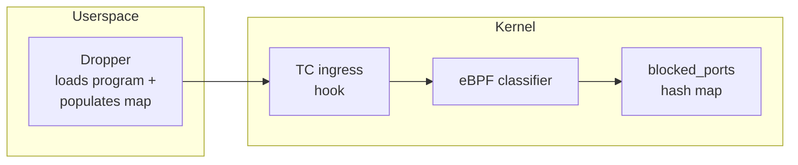

# tc-filter

An eBPF TC (traffic control) classifier written entirely in Go, built with `tinybpf`.

This example demonstrates attaching a BPF program to the TC ingress hook: writing a classifier in Go, compiling it through TinyGo and `tinybpf`, loading it into the kernel with [`cilium/ebpf`](https://github.com/cilium/ebpf), and dropping packets destined for a configurable blocked port.

## Overview

The classifier attaches to the TC ingress qdisc on a network interface. For every incoming IPv4 TCP or UDP packet, it extracts the destination port, looks it up in a hash map of blocked ports, and returns `TC_ACT_SHOT` to drop matching packets or `TC_ACT_OK` to let them pass.



## Project layout

```
bpf/
  filter.go               eBPF classifier source (compiled with TinyGo)
  filter_stub.go           Build tag placeholder for standard Go tooling
cmd/dropper/
  main.go                  Userspace entry point
internal/
  loader/                  ELF loading and TC qdisc/filter attachment (cilium/ebpf)
scripts/
  build.sh                 TinyGo + tinybpf build pipeline
  run.sh                   Build and run (requires root)
```

## Prerequisites

- Linux host with BPF and TC support
- Go 1.24+
- TinyGo 0.40+
- LLVM tools (`llvm-link`, `opt`, `llc`) version 20+
- Root privileges or `CAP_BPF` + `CAP_NET_ADMIN`

## Build

```bash
./scripts/build.sh
```

Produces `build/filter.bpf.o`. The build is configurable via environment variables:

| Variable | Default | Description |
|----------|---------|-------------|
| `TINYBPF_BIN` | *(built from source)* | Path to `tinybpf` binary |
| `BPF_CPU` | `v3` | BPF CPU version for `llc -mcpu` |

## Run

```bash
sudo ./scripts/run.sh
```

By default, the dropper blocks port 8080 on `eth0`. Override with flags:

```bash
sudo ./scripts/run.sh --iface lo --port 9090
```

Expected output:

```
attached TC classifier to eth0; blocking port 8080
press Ctrl+C to detach and exit
```

## Troubleshooting

| Symptom | Resolution |
|---------|------------|
| No program found / attach failure | Verify TinyGo output contains the `classifier/ingress` section. Check TC support: `tc qdisc show` |
| Permission denied | Run as root or grant `CAP_BPF` and `CAP_NET_ADMIN` capabilities |
| Packets not dropped | Ensure traffic targets the configured port. Check that the hash map is populated: `bpftool map dump name blocked_ports` |
| Toolchain errors | Run `tinybpf doctor` to diagnose |
