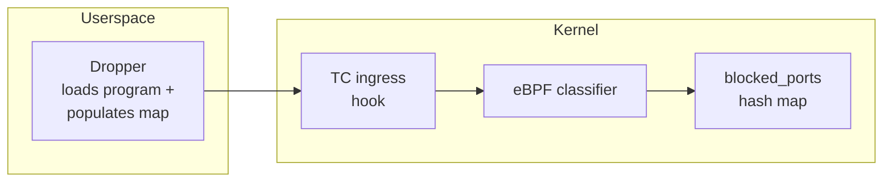

# tc-filter

A TC (traffic control) classifier that drops incoming packets by destination port. Parses Ethernet, IPv4, and TCP/UDP headers, looks up the destination port in a hash map, and returns `TC_ACT_SHOT` to drop or `TC_ACT_OK` to pass.


```mermaid
graph LR
    subgraph Kernel
        A["TC ingress<br>hook"] --> B["eBPF classifier"]
        B --> C["blocked_ports<br>hash map"]
    end
    subgraph Userspace
        D["Dropper<br>loads program +<br>populates map"] --> A
    end
```

**Concepts:** TC classifier, ingress attachment, port-based filtering, hash map

## Prerequisites

- Linux with TC support
- Root or `CAP_BPF` + `CAP_NET_ADMIN`
- [Toolchain requirements](../../docs/getting-started.md#prerequisites)

## Build and run

```bash
./scripts/build.sh
sudo ./scripts/run.sh
```

By default, blocks port 8080 on `eth0`. Override with flags:

```bash
sudo ./scripts/run.sh --iface lo --port 9090
```

Expected output:

```
attached TC classifier to eth0; blocking port 8080
press Ctrl+C to detach and exit
```

## Troubleshooting

| Symptom | Resolution |
|---------|------------|
| Attach failure | Check TC support: `tc qdisc show` |
| Permission denied | Run as root or grant `CAP_BPF` + `CAP_NET_ADMIN` |
| Packets not dropped | Ensure traffic targets the configured port. Check map: `bpftool map dump name blocked_ports` |
| Build errors | Run `tinybpf doctor` |

See [Troubleshooting](../../docs/troubleshooting.md) for general guidance.
