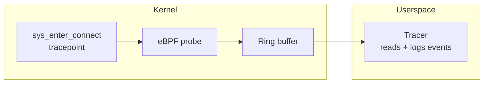

# tracepoint-connect

An eBPF tracepoint probe that traces outbound TCP connections, written entirely in Go, built with `tinybpf`.

This example demonstrates the full lifecycle: writing an eBPF tracepoint program in Go, compiling it through TinyGo and `tinybpf`, loading it into the kernel with [`cilium/ebpf`](https://github.com/cilium/ebpf), and reading live events from userspace.

## Overview

The probe attaches to the `syscalls/sys_enter_connect` tracepoint. On every outbound IPv4 TCP connection, it extracts the destination address and port, writes an event to an eBPF ring buffer, and a Go userspace program reads and logs each event.



## Project layout

```
bpf/
  connect.go               eBPF probe source (compiled with TinyGo)
  connect_stub.go          Build tag placeholder for standard Go tooling
cmd/tracer/
  main.go                  Userspace entry point
internal/
  loader/                  ELF loading and tracepoint attachment (cilium/ebpf)
  reader/                  Ring buffer read loop and event formatting
  event/                   Event struct and binary decoding
scripts/
  build.sh                 TinyGo + tinybpf build pipeline
  run.sh                   Build and run (requires root)
  smoke.sh                 Automated smoke test
```

## Prerequisites

- Linux host with BPF and tracepoint support
- Go 1.24+
- TinyGo 0.40+
- LLVM tools (`llvm-link`, `opt`, `llc`) version 20+
- Root privileges or `CAP_BPF` + `CAP_PERFMON`

## Build

```bash
./scripts/build.sh
```

Produces `build/connect.bpf.o`. The build is configurable via environment variables:

| Variable | Default | Description |
|----------|---------|-------------|
| `TINYBPF_BIN` | *(built from source)* | Path to `tinybpf` binary |
| `BPF_CPU` | `v3` | BPF CPU version for `llc -mcpu` |

## Run

```bash
sudo ./scripts/run.sh
```

In another terminal, generate outbound traffic:

```bash
curl -s https://example.com > /dev/null
```

Expected output:

```
2026-02-16T12:34:56Z pid=1234 proto=6 dst=93.184.216.34:443
```

## Smoke test

```bash
sudo ./scripts/smoke.sh
```

Builds the ELF object, runs the tracer, generates traffic, and asserts that at least one connection event is logged.

## Troubleshooting

| Symptom | Resolution |
|---------|------------|
| No program found / attach failure | Verify TinyGo output contains the `tracepoint/syscalls/sys_enter_connect` section. Check tracepoint availability: `ls /sys/kernel/debug/tracing/events/syscalls/sys_enter_connect/` |
| Permission denied | Run as root or grant `CAP_BPF` and `CAP_PERFMON` capabilities |
| No events logged | Ensure traffic is IPv4 TCP. Check tracer stderr for ring buffer or decode errors |
| Toolchain errors | Run `tinybpf doctor` to diagnose |
