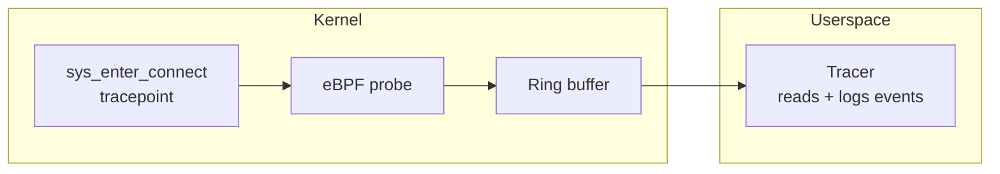

# tracepoint-connect

Traces outbound TCP connections via the `syscalls/sys_enter_connect` tracepoint. Extracts destination address and port, writes events to a ring buffer, and logs them from userspace.


```mermaid
graph LR
    subgraph Kernel
        A["sys_enter_connect<br>tracepoint"] --> B["eBPF probe"]
        B --> C["Ring buffer"]
    end
    subgraph Userspace
        C --> D["Tracer<br>reads + logs events"]
    end
```

**Concepts:** tracepoint, ring buffer, event struct, `cilium/ebpf` loader

## Prerequisites

- Linux with tracepoint support
- Root or `CAP_BPF` + `CAP_PERFMON`
- [Toolchain requirements](../../docs/getting-started.md#prerequisites)

## Build and run

```bash
./scripts/build.sh
sudo ./scripts/run.sh
```

Generate traffic in another terminal:

```bash
curl -s https://example.com > /dev/null
```

Expected output:

```
2026-02-16T12:34:56Z pid=1234 proto=6 dst=93.184.216.34:443
```

## Smoke test

```bash
sudo ./scripts/smoke.sh
```

## Troubleshooting

| Symptom | Resolution |
|---------|------------|
| Attach failure | Check tracepoint availability: `ls /sys/kernel/debug/tracing/events/syscalls/sys_enter_connect/` |
| Permission denied | Run as root or grant `CAP_BPF` + `CAP_PERFMON` |
| No events | Ensure traffic is IPv4 TCP |
| Build errors | Run `tinybpf doctor` |

See [Troubleshooting](../../docs/troubleshooting.md) for general guidance.
