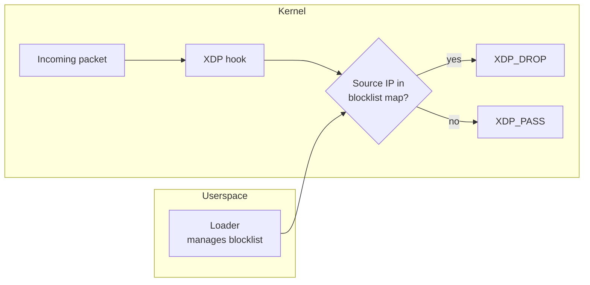

# xdp-filter

An XDP packet filter written entirely in Go, built with `tinybpf`.

This example demonstrates the full lifecycle: writing an eBPF XDP program in Go, compiling it through TinyGo and `tinybpf`, loading it into the kernel with [`cilium/ebpf`](https://github.com/cilium/ebpf), and managing a live blocklist from userspace.

## Overview

The program attaches to a network interface at the XDP hook. For each incoming packet it parses the Ethernet and IPv4 headers, looks up the source address in a BPF hash map, and returns `XDP_DROP` if found or `XDP_PASS` otherwise. The Go userspace loader populates the blocklist map and keeps the program attached until interrupted.



## Project layout

```
bpf/
  filter.go              eBPF XDP program source (compiled with TinyGo)
  filter_stub.go         Build tag placeholder for standard Go tooling
cmd/loader/
  main.go                Userspace entry point (load, attach, manage map)
internal/
  loader/                ELF loading and XDP attachment (cilium/ebpf)
scripts/
  build.sh               TinyGo + tinybpf build pipeline
  run.sh                 Build and run (requires root)
```

## Prerequisites

- Linux host with XDP support
- Go 1.24+
- TinyGo 0.40+
- LLVM tools (`llvm-link`, `opt`, `llc`) version 20+
- Root privileges or `CAP_BPF` + `CAP_NET_ADMIN`

## Build

```bash
./scripts/build.sh
```

Produces `build/filter.bpf.o`. The build is configurable via environment variables:

| Variable | Default | Description |
|----------|---------|-------------|
| `TINYGO_BIN` | `tinygo` | Path to TinyGo binary |
| `TINYBPF_BIN` | *(built from source)* | Path to `tinybpf` binary |
| `TINYGO_OUTPUT_FORMAT` | `ll` | TinyGo output format (`ll` for text IR) |
| `BPF_CPU` | `v3` | BPF CPU version for `llc -mcpu` |

## Run

```bash
# Attach to loopback and block 10.0.0.1
sudo BLOCK_IP=10.0.0.1 ./scripts/run.sh

# Or attach to a specific interface
sudo IFACE=eth0 BLOCK_IP=192.168.1.100 ./scripts/run.sh
```

The program stays attached until you press Ctrl+C.

## Managing the blocklist at runtime

While the program is running, use `bpftool` to manage the blocklist map:

```bash
# Add an address to block
sudo bpftool map update name blocklist key 10 0 0 1 value 0 0 0 0

# List blocked addresses
sudo bpftool map dump name blocklist

# Remove an address
sudo bpftool map delete name blocklist key 10 0 0 1
```

## Troubleshooting

| Symptom | Resolution |
|---------|------------|
| XDP attach failure | Check that the interface supports XDP. Some virtual interfaces require `xdpgeneric` mode; try `ip link set dev <iface> xdpgeneric obj filter.bpf.o sec xdp` |
| Permission denied | Run as root or grant `CAP_BPF` and `CAP_NET_ADMIN` capabilities |
| Packets not dropped | Verify the blocklist map has entries: `bpftool map dump name blocklist` |
| Toolchain errors | Run `tinybpf doctor` to diagnose |
