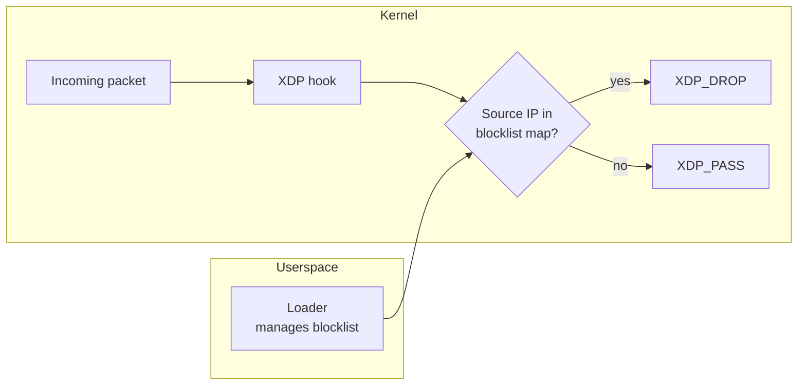

# xdp-filter

An XDP packet filter that drops incoming packets by source IP. Parses Ethernet and IPv4 headers, looks up the source address in a hash map blocklist, and returns `XDP_DROP` or `XDP_PASS`. The Go userspace loader populates the blocklist.


```mermaid
graph LR
    subgraph Kernel
        A["Incoming packet"] --> B["XDP hook"]
        B --> C{"Source IP in<br>blocklist map?"}
        C -- yes --> D["XDP_DROP"]
        C -- no --> E["XDP_PASS"]
    end
    subgraph Userspace
        F["Loader<br>manages blocklist"] --> C
    end
```

**Concepts:** XDP, packet parsing, hash map blocklist

## Prerequisites

- Linux with XDP support
- Root or `CAP_BPF` + `CAP_NET_ADMIN`
- [Toolchain requirements](../../docs/getting-started.md#prerequisites)

## Build and run

```bash
./scripts/build.sh

# Attach to loopback and block 10.0.0.1
sudo BLOCK_IP=10.0.0.1 ./scripts/run.sh

# Or attach to a specific interface
sudo IFACE=eth0 BLOCK_IP=192.168.1.100 ./scripts/run.sh
```

The program stays attached until you press Ctrl+C.

## Managing the blocklist at runtime

While the program is running, use `bpftool` to manage the blocklist:

```bash
# Add an address
sudo bpftool map update name blocklist key 10 0 0 1 value 0 0 0 0

# List blocked addresses
sudo bpftool map dump name blocklist

# Remove an address
sudo bpftool map delete name blocklist key 10 0 0 1
```

## Troubleshooting

| Symptom | Resolution |
|---------|------------|
| XDP attach failure | Some virtual interfaces require `xdpgeneric` mode |
| Permission denied | Run as root or grant `CAP_BPF` + `CAP_NET_ADMIN` |
| Packets not dropped | Verify map has entries: `bpftool map dump name blocklist` |
| Build errors | Run `tinybpf doctor` |

See [Troubleshooting](../../docs/troubleshooting.md) for general guidance.
